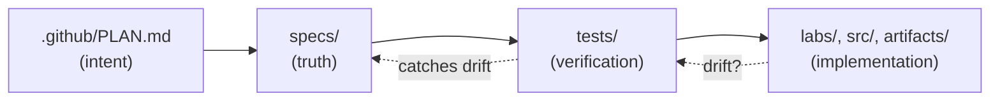
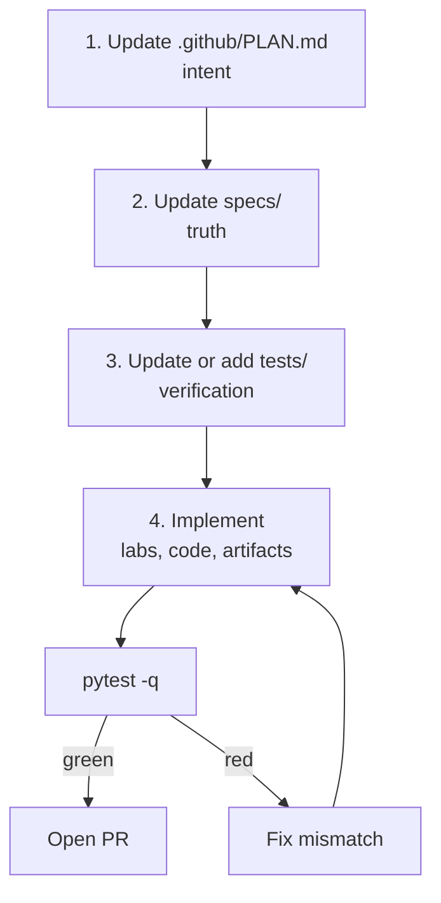

# Maintainers guide

Guidance for maintainers evolving the **Contoso Travel Concierge Workshop**.
Read this before adding a lab, changing a schema, or cutting a release.

If you are a **learner**, start at [`README.md`](../README.md) instead.
If you are a **contributing coding agent**, start at [`AGENTS.md`](../AGENTS.md).

---

## Table of contents

1. [Guiding principles](#guiding-principles)
2. [Repository structure](#repository-structure)
3. [How this repo is built (SDD)](#how-this-repo-is-built-sdd)
4. [Adding or modifying content — the standard flow](#adding-or-modifying-content--the-standard-flow)
5. [Testing locally](#testing-locally)
6. [Release process](#release-process)
7. [Common maintenance tasks](#common-maintenance-tasks)
8. [Troubleshooting the invariants](#troubleshooting-the-invariants)

---

## Guiding principles

| Principle | What it means in practice |
|---|---|
| **Living resource** | `main` is evergreen. Pin per-event branches (see [Release process](#release-process)) — never freeze `main`. |
| **One concept per lab** | Every lab teaches a single concept or completes a single step of the DevOps loop. Split a lab that grows past ~30 minutes. |
| **Problem-first, verify-at-end** | Learners open a lab knowing what they'll solve and finish it knowing they solved it. Enforced by the template + tests. |
| **Reproducible** | Every generative step ships a `reference/` artifact so learners can always continue. `src/` can always be reset from `src.original/`. |
| **Spec-driven** | Specs and tests catch drift on every PR. When the plan changes, the specs and tests change with it, in the same PR. |
| **Guide, don't do** | The workshop-coach coaches; it never completes learner tasks. Do not weaken this contract. |

---

## Repository structure

```
/
├── README.md                       Learner-facing landing
├── AGENTS.md                       Guidance for coding agents in this repo
├── LICENSE
├── .github/
│   ├── PLAN.md                     ★ Canonical course plan (source of truth for design)
│   ├── MAINTAINERS.md              This file
│   ├── workflows/verify-course.yml CI: pytest on every PR
│   └── agents/
│       ├── workshop-coach.agent.md GitHub Copilot custom agent
│       └── skills/                 Six skill files the coach composes from
├── specs/                          ★ Machine-readable truth
│   ├── course.yaml                 Phases, labs, artifacts, coach mapping
│   ├── lab-template.schema.json    Required sections/callouts per lab
│   ├── agent.schema.json           Frontmatter contract for .github/agents/
│   └── schemas/                    Data + artifact JSON schemas
├── tests/                          ★ Verification of the specs
│   ├── conftest.py                 Spec loader + section regexes
│   ├── test_structure.py           Dirs exist, no orphan labs, prereqs valid
│   ├── test_lab_content.py         Every lab uses the template sections
│   ├── test_links.py               Internal markdown links resolve
│   ├── test_data_schemas.py        CSVs match their schemas
│   ├── test_artifacts.py           reference/ artifacts validate
│   ├── test_coach.py               Coach frontmatter valid; skills exist
│   └── test_reset.py               scripts/reset.sh dry-run works
├── data/                           Shared CSVs (single source of truth)
├── src/                            Hosted-agent working copy (learners edit)
├── src.original/                   Hosted-agent pristine baseline (read-only)
├── artifacts/
│   ├── datasets/{generated/, reference/}
│   ├── evaluators/{generated/, reference/}
│   └── prompts/{generated/, reference/}
├── infra/                          azd bicep/parameters
├── scripts/
│   ├── reset.sh                    Restore src/ from src.original/
│   ├── use-reference.sh            Drop reference artifact into generated/
│   ├── provision-portal.md         Portal walkthrough content
│   └── seed-prompt-agent.sh        Optional prompt-agent seeder
├── labs/
│   ├── _template/lab-template.md   Canonical pedagogy pattern
│   ├── fundamentals/               00–06 provisioning + deployment
│   ├── core/                       00–05 DevOps loop + capstone
│   └── more/                       Extensible single-question deep dives
├── .devcontainer/
│   ├── Dockerfile                  Python 3.13 bookworm + az/azd/gh
│   ├── devcontainer.json           VS Code extensions, coach volume mount
│   ├── post-create.sh              First-run pip install + azd extensions
│   └── README.md
├── requirements.txt                Runtime deps
├── requirements-dev.txt            Test-time deps (pytest, pyyaml, jsonschema)
└── .gitignore
```

Directories marked ★ are the **spec-driven core**: change one, change all three.

---

## How this repo is built (SDD)

The workshop treats itself as a product with invariants. We use lightweight
**Spec-Driven Development** so that when anything changes, tests catch drift.

### The three layers



1. **`.github/PLAN.md`** — the human-readable *intent*. Read first when
   contributing. Updated when design changes.
2. **`specs/`** — the machine-readable *truth*.
   - `course.yaml` declares every phase, lab, prerequisite, produced/consumed
     artifact, and the coach mapping. This is the same file the coach reads
     to know where the learner is.
   - JSON schemas lock down data files, artifact shapes, and agent frontmatter.
3. **`tests/`** — pytest suites that *verify the truth*. Fast (< 30s),
   pure-Python, no Azure dependency.
4. **`labs/`, `src/`, `artifacts/`** — the *implementation* that must satisfy
   the specs.

### What each test guards

| Test | Invariant |
|------|-----------|
| `test_structure.py`    | Required dirs exist. Every lab in `course.yaml` has a file. No orphan labs. Every `prereqs` reference resolves. |
| `test_lab_content.py`  | Every lab file contains all six template sections (🎯 🧭 📋 ✅ 🧠 ➡️). |
| `test_links.py`        | Every internal markdown link resolves to a real file. |
| `test_data_schemas.py` | Every row in `data/*.csv` validates against `specs/schemas/*.json`. |
| `test_artifacts.py`    | Every shipped `reference/*.jsonl` validates against its schema. |
| `test_coach.py`        | `workshop-coach.agent.md` frontmatter matches the agent schema; every listed skill exists; the behavior-contract phrases are present. |
| `test_reset.py`        | `scripts/reset.sh --dry-run` runs without error. |

### The coach reads the same spec

Because `specs/course.yaml` is authoritative, the `progress-tracker` and
`lab-guide` skills read lab order + prereqs from it — the coach and the tests
share one source of truth.

---

## Adding or modifying content — the standard flow

Follow this order for **every change** — small or large. The specs and tests
are your safety net.



### Cheat sheet by change type

| Change | PLAN.md? | specs/course.yaml? | schemas/? | tests/? | labs/? | artifacts/? |
|--------|:--------:|:------------------:|:---------:|:-------:|:------:|:-----------:|
| Reword a lab step                    | – | – | – | – | ✅ | – |
| Add a screenshot                     | – | – | – | – | ✅ | – |
| Add a new lab                        | ✅ | ✅ | – | (auto) | ✅ | maybe |
| Rename a lab                         | ✅ | ✅ | – | (auto) | ✅ (rename + fix links) | – |
| Reorder labs                         | ✅ | ✅ | – | (auto) | ✅ (fix ➡️ Next links) | – |
| Add a new data column                | ✅ | – | ✅ | ✅ (schema) | ✅ (mention) | – |
| Add a new artifact type              | ✅ | ✅ | ✅ | ✅ | ✅ | ✅ |
| Change coach behavior contract       | ✅ | – | – | ✅ (test_coach) | – | – |
| Add a new coach skill                | ✅ | ✅ (coach.skills) | – | ✅ (test_coach) | – | – |
| Bump the hosted-agent baseline (`src.original/`) | ✅ | – | – | – | ✅ (capstone) | – |
| Add a More Lab                       | ✅ | ✅ | – | (auto) | ✅ (new file + more/README.md) | maybe |

### Concrete example: adding a new lab

1. **Update `.github/PLAN.md`** — add the lab to the phase's outline; state
   the concept it teaches.
2. **Update `specs/course.yaml`** — add an entry under the relevant phase
   with `id`, `title`, `loop_node`, `time_min`, `prereqs`, `produces`,
   `consumes`.
3. **Create the file** from `labs/_template/lab-template.md`. Fill every
   section (do not leave `TODO` in `🎯 Goal` or `✅ Verify` — those are the
   contract with the learner).
4. **Fix the previous lab's `➡️ Next`** to point at the new one.
5. **If the lab produces an artifact**, drop a reference file into
   `artifacts/<type>/reference/<name>.<ext>` and confirm it validates.
6. `pytest -q` → green → open a PR.

### Concrete example: bumping the hosted-agent baseline

1. Make your changes in a *scratch* checkout of `src/`.
2. When happy, copy the new contents into **both** `src/` and `src.original/`
   (they must match on `main`).
3. Update `.github/PLAN.md` if the change alters what any lab does.
4. Update capstone lab (`labs/core/05-capstone-hosted.md`) if the surface changed.
5. `pytest -q` (especially `test_reset.py`, `test_structure.py`) → PR.

---

## Testing locally

### Quick smoke check

```bash
pip install -r requirements-dev.txt
pytest -q
```

Runtime: < 30 seconds. No Azure keys required.

### While iterating

Run a single suite:

```bash
pytest tests/test_structure.py -v
pytest tests/test_lab_content.py -v -k core
```

### Devcontainer

Rebuilding the container triggers `.devcontainer/post-create.sh`, which runs
the tests as a smoke check. Watch that output the first time you rebuild.

---

## Release process

`main` is the evergreen source of truth. Per-event releases are **branches**,
never rewrites of `main`.

### Cutting an event branch

1. Ensure `main` is green (`pytest -q` locally + CI on last merge).
2. Create the branch:
   ```bash
   git checkout -b msbuild26-release
   git push -u origin msbuild26-release
   ```
3. Add the branch to the **Session delivery** table in `README.md`
   (create the table on first release).
4. Announce in the release notes.

### Version bumps

- `specs/course.yaml → version` follows semver:
  - **Patch** — content fixes, screenshot updates, wording
  - **Minor** — new labs, new More Labs, new artifacts
  - **Major** — structural changes (phase reorg, coach contract change,
    baseline bump)
- Tag on `main`: `v0.2.0`, `v1.0.0`, etc.

### Deprecating a lab

1. Mark it in `.github/PLAN.md` under a **Deprecated** section.
2. Move the file to `labs/_archive/` (create if missing) and remove from
   `specs/course.yaml`.
3. Fix any inbound `➡️ Next` or `prereqs` references.
4. `pytest -q` → PR.

---

## Common maintenance tasks

### Triaging `lab-idea` issues

Learners and maintainers file lab suggestions and questions via the
[**💡 Lab idea or learner question**](../../issues/new/choose) issue form
(defined at `.github/ISSUE_TEMPLATE/lab-idea-or-question.yml`). Recommended
cadence: **monthly triage**.

Suggested flow:

1. Filter open issues by `label:lab-idea`.
2. Group by the `loop_node` and `agent_type` answers.
3. For each candidate, decide:
   - **Promote** — worth becoming a More Lab. Assign a maintainer, add label
     `promoted`, and follow [Add a new More Lab](#add-a-new-more-lab). Link
     the issue from the lab's `🧠 Recap` or footer, and reference the lab
     from the issue before closing.
   - **Merge** — duplicate of another idea. Close referencing the primary.
   - **Defer** — good idea but not now. Label `backlog`.
   - **Decline** — out of scope. Close with a friendly explanation.
4. Answer any pure-question issues with a coach-style pointer (link to lab
   or docs) — do **not** paste the answer wholesale; the coach contract
   applies to maintainers replying to learners too.

### Add a new More Lab

1. Add entry under `phases.more.labs` in `specs/course.yaml`.
2. Create the file from `labs/_template/lab-template.md`.
3. Link it in `labs/more/README.md`.
4. `pytest -q` → PR.

### Rename an artifact

1. Rename in `artifacts/<type>/reference/`.
2. Update every `produces:` / `consumes:` in `specs/course.yaml`.
3. Grep labs for the old name; update.
4. `pytest -q` → PR.

### Update a screenshot

1. Save to `labs/<phase>/images/`.
2. Reference it from the lab step.
3. No test change needed.

### Update model recommendations

1. Update `.github/PLAN.md` if the model shape changes semantically.
2. Update `labs/fundamentals/03-deploy-models.md`.
3. Update `requirements.txt` if the SDK version needs to change.
4. `pytest -q` → PR.

### Rebrand something

Do **not** silently rewrite branding. If the fictional entity ever needs to
change, do it as a coordinated pass:

1. Update `.github/PLAN.md`.
2. Search and replace across `data/`, `artifacts/`, `labs/`, `src/`,
   `src.original/`.
3. Update JSON schema `pattern` fields in `specs/schemas/`.
4. `pytest -q` (`test_data_schemas.py` catches missed IDs) → PR.

---

## Troubleshooting the invariants

When a test fails, that's the guardrail working. Common failures and fixes:

| Failure | Cause | Fix |
|---------|-------|-----|
| `test_structure.py: lab file missing for X/Y` | Added to `course.yaml` but no file created | Create the file from the template. |
| `test_structure.py: orphan lab file not in course.yaml` | Created a file but didn't add to `course.yaml` | Add the entry, or move the file to `labs/_archive/`. |
| `test_lab_content.py: X/Y missing section: verify` | Deleted or renamed a section header | Restore the exact `## ✅ Verify` header. |
| `test_links.py: X/Y -> ./foo.md` | Renamed/moved a linked file | Fix the link or restore the file. |
| `test_data_schemas.py: <row> failed schema` | New/edited CSV row doesn't match schema | Fix the data or bump the schema. |
| `test_coach.py: missing skill: <name>` | Added a skill to coach frontmatter but no file | Create `.github/agents/skills/<name>.md`. |
| `test_reset.py: reset.sh must be executable` | `chmod` reverted | `chmod +x scripts/*.sh`. |

If you legitimately want to break an invariant (e.g., temporary state during a
big refactor), open a draft PR labeled `wip:` and fix before marking ready.
Do not disable tests.

---

## Where to ask

- Open an issue on this repo for course/content questions.
- Ping the maintainer for release coordination.
- The **workshop-coach** is for learners, not maintainers — do not rely on it
  as a design-review agent.
