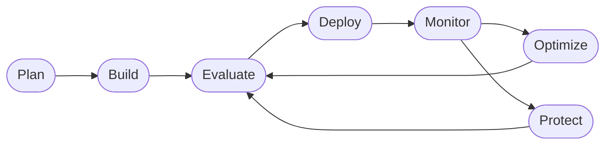

# Course Plan — Contoso Travel Concierge Workshop

> Canonical plan for the workshop. Edit this file when the course structure,
> pedagogy, or coach behavior changes — it is the reference used for future
> revisions and by contributors.

## Problem

Consolidate two prior workshops (`Azure-Samples/microsoft-foundry-e2e-agent-observability-workshop`
and `microsoft/Build26-LAB540`) into **one living course** that teaches the full
**Agent DevOps loop** on Microsoft Foundry: plan → build → evaluate → deploy →
monitor → optimize → protect.

The course uses one consistent scenario — **Contoso Travel Concierge** — with a
shared dataset across a **Prompt Agent** (no-code, portal) and a **Hosted Agent**
(containerized code). Learners complete a finite Core journey, then explore an
infinitely extensible library of deep-dive labs. A repo-scoped
**workshop-coach** GitHub Copilot agent supports self-guided learners with
just-in-time guidance and progress tracking — never doing the work for them.

## Three-phase course structure

1. **Fundamentals** — provision + deploy (everyone at the same starting line)
2. **Core Labs** — complete the Agent DevOps loop on the Prompt Agent; apply it
   to the Hosted Agent as a capstone (finite, beginner-completable)
3. **More Labs** — one-question-per-lab deep dives (infinitely extensible)

### Agent DevOps loop (anchor diagram)



Every lab highlights the node it teaches.

## Locked design decisions

| Decision | Choice |
|---|---|
| Agent name | **Contoso Travel Concierge** |
| Shared dataset | `data/{flights,hotels,car_rentals}.csv` — single source of truth |
| Implementations | Prompt Agent (portal, Core Labs) + Hosted Agent (`src/`, capstone + More Labs) |
| Reset mechanic | `src.original/` snapshot + `scripts/reset.sh` (visible, diff-friendly) |
| Provisioning | Both paths: `azd up` (self-guided) **and** Foundry portal walkthrough |
| Living resource | Evergreen `main` + pinned event branches |

## Pedagogy — one concept or one flow step per lab

Every lab file follows the same **problem-first, verify-at-the-end** template so
learners always know what they're solving and can prove they solved it.

### Lab template

Canonical template lives at `labs/_template/lab-template.md`. Structure:

1. **Header** — what you'll do (one sentence), time, prerequisites
2. **🎯 Goal** — single concept taught or single DevOps-loop step completed
3. **🧭 Where this fits** — small mermaid diagram anchoring the lab on the loop
4. **📋 Steps** — numbered atomic steps with inline "you should now see…" checkpoints
5. **✅ Verify** — an explicit, testable check (URL, CLI, expected output)
6. **🧠 Recap** — 2–4 bullets: what you learned, what changed
7. **➡️ Next** — link to the next lab

### Visual documentation guidelines

- **Mermaid** for every phase overview, loop location, and multi-step flow
- **Tables** for comparisons (paths, evaluators, metrics, models) — no prose lists
- **Screenshots** in `labs/<phase>/images/` with descriptive alt text, cropped
- **Callouts:** `> 🎯` goal · `> ✅` verify · `> 💡` tip · `> ⚠️` gotcha ·
  `> 🧭` where-you-are · `> 🧠` recap

## Workshop-Coach agent

A repo-scoped GitHub Copilot custom agent for self-guided learners. **Coaches**
learning; never completes tasks. Skills-based composition.

- File: `.github/agents/workshop-coach.agent.md`
- Skills: `.github/agents/skills/{progress-tracker,lab-guide,verify-check,bookmark,explore-suggest,resume}.md`
- Progress state (per-learner, outside repo): `~/.contoso-coach/progress.json`

### Behavior contract

- **Never** edits files, runs destructive commands, or completes lab steps
- **Always** resolves current phase and lab from progress state before responding
- **Answers with guidance and questions back** — points to the relevant lab
  section, evaluator, or docs link; does not paste solutions
- Engages exploratory tangents, **bookmarks** the current lab, and offers to resume
- Suggests 2–3 "you could also ask…" prompts on exploratory replies
- Politely refuses "do it for me" requests

### Skills

| Skill | Purpose |
|-------|---------|
| `progress-tracker` | Read/write `~/.contoso-coach/progress.json` |
| `lab-guide` | Load the current lab and produce next-step guidance without revealing full answers |
| `verify-check` | Walk the learner through the lab's `## ✅ Verify` block; ask what they see |
| `bookmark` | Save/restore learner position when detouring |
| `explore-suggest` | Offer tangential prompts anchored to current lab |
| `resume` | Restore the last bookmark and re-anchor the learner |

## Artifacts strategy — reproducible lab outputs

Every lab that *generates* something (dataset, evaluator, optimized prompt,
config) also ships a **known-good reference** so learners can drop it in and
keep moving even if their own generation gave weak output. This mirrors the
`src/` vs `src.original/` pattern, generalized.

```
artifacts/
├── datasets/
│   ├── generated/     # learner outputs land here (gitignored)
│   └── reference/     # known-good, versioned, ships in repo
├── evaluators/
│   ├── generated/
│   └── reference/
└── prompts/
    ├── generated/
    └── reference/
```

- **`generated/`** — learner's own outputs; gitignored per subfolder via
  `.gitignore` entries; kept out of the repo so learners diff freely.
- **`reference/`** — canonical, versioned artifacts that ship with the repo.
  Safe to copy over `generated/` to unblock the next lab.
- **`scripts/use-reference.sh <type> <name>`** — copies a reference artifact
  into the matching `generated/` slot so labs are individually runnable.
- **Every generative lab** ends with a "if yours doesn't look like this,
  run `./scripts/use-reference.sh …` to continue" callout. This guarantees
  reproducibility across the finite Core Labs path.

The course spec (`specs/course.yaml`) declares each lab's `produces:` and
`consumes:` artifacts so tests can verify the wiring.

## Spec-driven development (SDD)

The workshop treats itself as a product with invariants. Specs and tests are
the cheapest way to catch drift as the course evolves.

### What is spec'd

| Spec file | What it locks down |
|-----------|--------------------|
| `specs/course.yaml` | Phases, labs (order, prereqs, produces/consumes artifacts), coach mapping — **single source of truth for the coach and the tests** |
| `specs/lab-template.schema.json` | Required sections/callouts every lab file must contain |
| `specs/schemas/{flights,hotels,car_rentals}.schema.json` | Column names, types, and constraints for `data/` CSVs |
| `specs/schemas/{dataset,evaluator,prompt}.schema.json` | Shape for `artifacts/**/reference/*` |
| `specs/agent.schema.json` | Required frontmatter for `.github/agents/*.agent.md`; skills listed must exist |

### What the tests verify

| Test suite | Verifies |
|------------|----------|
| `tests/test_structure.py` | Required dirs exist; no orphan labs; every lab in `specs/course.yaml` has a file and vice versa; `src/` matches `src.original/` on a fresh checkout |
| `tests/test_lab_content.py` | Every lab has 🎯 / 🧭 / 📋 / ✅ / 🧠 / ➡️ sections per the template schema |
| `tests/test_links.py` | Every internal link and every `➡️ Next` resolves |
| `tests/test_data_schemas.py` | CSVs in `data/` validate against JSON schemas |
| `tests/test_artifacts.py` | Every `artifacts/**/reference/*` validates against its schema; every lab's declared `produces:` artifact exists in `reference/` |
| `tests/test_coach.py` | `workshop-coach.agent.md` frontmatter valid; every listed skill exists; behavior-contract phrases present |
| `tests/test_reset.py` | `scripts/reset.sh --dry-run` correctly identifies `src/` vs `src.original/` drift |

### CI

- `.github/workflows/verify-course.yml` runs `pytest` on every PR and push to
  `main`. If a change breaks an invariant, the PR fails.
- Tests are fast (< 30s), pure Python, no Azure dependency — no keys needed
  in CI.

### The course spec is the coach's map

Because `specs/course.yaml` declares the lab order, prereqs, and per-lab
artifacts, the `lab-guide` and `progress-tracker` skills read from it rather
than hard-coding paths. One source of truth for both the tests and the coach.

## Repository layout

```
/
├── README.md
├── LICENSE
├── AGENTS.md                       # General Copilot + Foundry skills guidance
├── .github/
│   ├── PLAN.md                     # THIS FILE — living source of truth
│   ├── workflows/verify-course.yml # CI: runs pytest on PR
│   └── agents/
│       ├── workshop-coach.agent.md
│       └── skills/                 # 6 skills
├── specs/
│   ├── course.yaml                 # Phases, labs, artifacts, coach mapping
│   ├── lab-template.schema.json
│   ├── agent.schema.json
│   └── schemas/                    # data + artifact JSON schemas
├── tests/                          # pytest suites (structure, content, links, schemas, coach, reset)
├── data/                           # Shared CSVs — single source of truth
├── src/                            # Hosted agent working copy (learners edit)
├── src.original/                   # Pristine snapshot (read-only reference)
├── artifacts/
│   ├── datasets/{generated/, reference/}
│   ├── evaluators/{generated/, reference/}
│   └── prompts/{generated/, reference/}
├── infra/                          # azd bicep/terraform
├── scripts/                        # reset.sh, use-reference.sh, provision-portal.md, seed-prompt-agent.sh
├── labs/
│   ├── _template/lab-template.md
│   ├── fundamentals/               # 00–06 labs
│   ├── core/                       # 00–05 labs (incl. capstone)
│   └── more/                       # Extensible deep dives
├── requirements.txt
└── .devcontainer/
```

## Reproducibility guarantees

- `data/` is the single source of truth for both agents
- `src.original/` is the pristine baseline for the Hosted Agent
- `scripts/reset.sh` restores `src/` from `src.original/` in one command
- Every lab that generates an artifact ships a `reference/` counterpart;
  `scripts/use-reference.sh` drops it into place to unblock the next lab
- `specs/course.yaml` declares each lab's `produces:` / `consumes:` so tests
  catch missing references before shipping
- Prompt Agent baseline instructions captured in
  `labs/fundamentals/04-create-prompt-agent.md` so learners can re-seed
- Coach progress file lives outside the repo → does not leak between learners

## Living-document policy

**`PLAN.md` is updated as the course changes.** When we add a new lab, change
an artifact shape, or refine the coach's behavior, this file is edited in the
same PR. The intended flow (details in
[`.github/MAINTAINERS.md`](./MAINTAINERS.md)):

1. Propose the change here (edit `PLAN.md`)
2. Update the relevant `specs/*.yaml|json` to match
3. Update or add tests
4. Implement (labs, code, artifacts)
5. `pytest` green → merge

If `PLAN.md` and the implementation disagree, the tests fail — that's the
guardrail.

## Open questions

- ~~Exact model list (agent model, evaluator model, embedding?)~~ **Decided:**
  concierge `gpt-5.4-mini` (version `2026-03-17`) + judge `gpt-5.4` (version
  `2026-03-05`), both GlobalStandard, auto-deployed by `azd up`
  (`infra/main.bicep`). Model region/version/SKU reference:
  <https://learn.microsoft.com/en-us/azure/foundry/foundry-models/concepts/models-sold-directly-by-azure?pivots=azure-direct-others>
- Whether to port the LAB540 CSVs as-is (rebranded to Contoso) or curate a
  smaller eval-friendly subset

## Devcontainer

Ships from day one for a reproducible dev environment.

- **Base image:** `mcr.microsoft.com/devcontainers/python:1-3.13-bookworm`
- **`.devcontainer/Dockerfile`** — customization surface for system packages,
  CLIs (Azure CLI, `azd`, `gh`), and image-level tools
- **`.devcontainer/post-create.sh`** — first-run setup: `pip install`,
  `azd ext install azure.ai.agents`, `chmod +x scripts/*.sh`, spec-tests
  smoke check
- **`.devcontainer/devcontainer.json`** — VS Code extensions, coach progress
  volume mount at `~/.contoso-coach`

---

## Progress tracking

Coverage against the two source workshops
(`Azure-Samples/microsoft-foundry-e2e-agent-observability-workshop` = **Obs**,
`microsoft/Build26-LAB540` = **LAB540**). Update this table as we ship.

Legend: ✅ complete · 🟡 stub/partial · ❌ not started · – not applicable

| Area | Obs | LAB540 | This repo | Notes |
|---|:---:|:---:|:---:|---|
| Scenario + data (unified) | ✅ | ✅ | ✅ | Contoso Travel Concierge; CSVs + reference datasets shipped |
| azd provisioning | – | ✅ | ✅ | `fundamentals/01-provision-azd.md` — full body from LAB540 |
| Portal provisioning | ✅ | – | ✅ | `fundamentals/02-provision-portal.md` — full body |
| Model deployment | ✅ | ✅ | ✅ | `fundamentals/03-deploy-models.md` — full body (azd + portal paths) |
| Prompt Agent creation | ✅ | – | ✅ | `fundamentals/04-create-prompt-agent.md` — references baseline artifact |
| Hosted Agent source (`src/` + `src.original/`) | – | ✅ | ✅ | main.py, agent.yaml, Dockerfile, instructions/, scripts/ ported + rebranded |
| Hosted Agent deploy lab | – | ✅ | ✅ | `fundamentals/05-deploy-hosted-agent.md` — full body |
| Bicep infra (`infra/`) | – | ✅ | ✅ | main.bicep, params, core/{ai,host,monitor,search,storage} ported + rebranded |
| Fundamentals verify lab | – | – | ✅ | `fundamentals/06-verify.md` — canonical question, both agents |
| Core: observability in portal | ✅ | partial | ✅ | `core/01-observe-portal.md` — playground + live evaluators + traces |
| Core: evaluation | ✅ | – | ✅ | `core/02-evaluate-portal.md` — batch eval against reference dataset |
| Core: optimize with Foundry Skills | ✅ | – | ✅ | `core/03-optimize-skills.md` — Copilot + microsoft-foundry observe skill |
| Core: monitoring | ✅ | ✅ | ✅ | `core/04-monitor-portal.md` — Monitor tab + agent-helper insights |
| Core: capstone on hosted agent | – | – | ✅ | `core/05-capstone-hosted.md` — full loop on Hosted Agent |
| More: red-teaming | ✅ | – | ✅ | `labs/more/red-teaming.md` — safety evaluator batch + mitigation |
| More: troubleshooting | partial | partial | ✅ | `labs/more/troubleshooting.md` — trace-driven diagnosis cheat sheet |
| More: continuous evaluation | ✅ | – | ✅ | `labs/more/continuous-eval.md` — CI job + thresholds |
| More: trace-driven datasets | ✅ | – | ✅ | `labs/more/trace-driven-datasets.md` — KQL → JSONL → promote flow |
| Reference prompt artifact | – | – | ✅ | `artifacts/prompts/reference/prompt-agent-baseline-v1.md` |
| Screenshots | ✅ | ✅ | ❌ | Every lab has `<!-- TODO(nitya): screenshot -->` markers ready for capture |
| Workshop-coach agent | – | – | ✅ | Contract + 6 skills; passes tests |
| Specs + tests + CI | – | – | ✅ | 14 pytest tests, GH Actions verify-course.yml |
| Devcontainer | – | – | ✅ | Python 3.13 bookworm + az/azd/gh + coach volume |
| Reproducibility (`reset.sh`, `use-reference.sh`) | – | – | ✅ | Scripts + reference artifacts |
| Issue template for lab ideas | – | – | ✅ | `.github/ISSUE_TEMPLATE/lab-idea-or-question.yml` |
| Maintainers guide | – | – | ✅ | `.github/MAINTAINERS.md` |
| Rebrand pass (Zava → Contoso) | – | – | ✅ | Applied to data + artifacts + src/ + src.original/ + infra/ |

### Next-up order

Remaining work for parity:

1. **Screenshots** — walk each lab and fill the `<!-- TODO(nitya): screenshot -->` markers with captured images under `labs/<phase>/images/`.
2. **Refine live commands** — confirm exact `azd ai agent invoke` / evaluation-runner commands once you've done a live end-to-end pass, and replace remaining TODOs in the code fences.
3. **Ship the reference optimized prompt** at `artifacts/prompts/reference/prompt-agent-optimized-v2.md` after the first live optimization run so learners can compare before/after without running the loop.
4. **Optional** — add a `More Labs` entry for a specific published Foundry feature (e.g., "Bring your own evaluator") once you validate it end-to-end.
