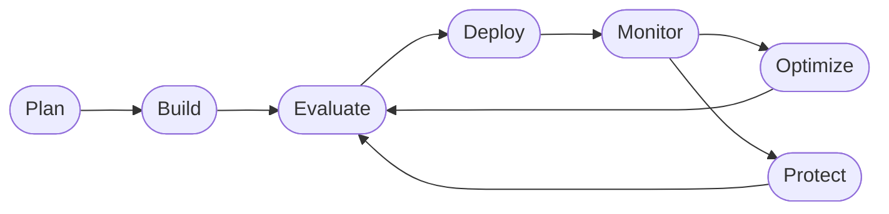

<div align="center">
<table width="100%">
<tr>
<td<div style="background:#111111;color:#f2c200;padding:16px;margin:4px;border-radius:6px;font-family:sans-serif;">

🟨⬛🟨⬛🟨⬛🟨⬛🟨⬛🟨⬛🟨⬛🟨⬛🟨⬛🟨⬛🟨⬛🟨⬛

### 🚧 Work in Progress 🚧

**This workshop is under active development and testing.**. <br/>
Please wait till this banner is removed before using it for self-guided or instructor-led delivery.

🟨⬛🟨⬛🟨⬛🟨⬛🟨⬛🟨⬛🟨⬛🟨⬛🟨⬛🟨⬛🟨⬛🟨⬛

</div></td>
</tr>
</table>
</div>

<div align="center">

# Build, Evaluate & Optimize AI Agents with Microsoft Foundry & GitHub Copilot

[Overview](#overview) · [Quickstart](#quickstart) · [Core Labs](#core-labs) · [More Labs](#more-labs) · [Feedback](#feedback)

</div>


> **Scenario.** Contoso is a fictitious enterprise retail company serving customers worldwide. Contoso Travel Concierge is their internal travel planning tool, used by employees to book flights, cars and hotels - and manage expenses - while ensuring they are in compliance with company travel policies.
>
> **Workshop.** This workshop was built with the help of coding agents grounded in our docs, with human oversight and review for correctness and consistency. If you find any discrepancies or have questions, [please file an appropriate issue](https://github.com/microsoft-foundry/agent-optimization-workshop/issues) for our attention.

<br/>

## Overview

Building an AI agent on Microsoft Foundry can be fairly straightforward. Create a new project, deploy a relevant model, configure agent instructions and tools - then deploy it to get an endpoint you can send requests to (from a UI-based playground or a code-based client).

But agent behaviors can be non-deterministic. Building reliable agents - that meet required cost, latency and quality targets - requires end-to-end observability. Start with evaluations that assess the quality, performance and safety of your agent with built-in and custom metrics. Use tracing (logs) to debug issues and build your intuition for where your agent incurs cost and latency. And use application insights to understand your agent performance in production, at scale.

Real-world deployments can also help identify agent drift from the desired performance targets. For instance, models may evolve or new edge cases may be revealed from actual usage. Keeping your agent operating correctly while consistemtly meeting desired criteria - requires _continuous optimization_, reflected by the **Agent DevOps loop** shown below.




This repository provides a series of hands-on labs that walks you through this loop on Microsoft Foundry — from provisioning to deployment to continuous optimization — usingthe **Contoso Travel Concierge** multi-agent scenario.


The course is organized in three phases:

| Phase | What you do | Time |
|-------|-------------|------|
| **Fundamentals** | Provision Foundry (`azd` or portal), deploy models, create the Prompt Agent, deploy the Hosted Agent | ~75 min |
| **Core Labs** | Observe → Evaluate → Optimize → Monitor on the Prompt Agent; capstone on the Hosted Agent | ~90 min |
| **More Labs** | Single-question deep dives against the deployed agents | 20–30 min each |


> **EXPERIMENTAL**: <br/>
> The repository is configured with a [**workshop-coach**](./.github/agents/workshop-coach.agent.md) agent (using GitHub Copilot) that self-guided learners can use to ask for explanations or debug issues, without losing track of their progress. The coach guides you through the next step but never does the task for you, so you learn by doing.

<br/>

## Quickstart

The repository is configured with a [`.devcontainer/`](./.devcontainer/) that defines the default Python environment and dependencies required to run the exercises. The fastest way to get started and running your first lab is:

1. **Fork the repo** to your profile to get a sandbox you can modify
1. **Launch the Dev Container** using GitHub Codespaces (browser) or Docker Desktop (device)

This should automatically invoke the scripts to install Python dependencies, update required tooling, and initialize environment for lab execution. Wait till you see an active VS Code terminal - and use these commands to verify installation status.

```bash
# Python 3.13+
python --version

# Azure CLI ("azure-cli": "2.89.0" or higher)
az version

# Azure Developer CLI (azd version 1.30.0  or higher)
azd version

# GitHub Copilot CLI (GitHub Copilot CLI 1.0.78. or higher)
copilot version

# GitHub CLI (gh version 2.97.0 or higher)
gh --version
```

> Prefer local setup? Create a virtual environment and install the tools manually. You will need Python 3.13+, `az`, `azd`, `copilot` and `gh` on your PATH.


<br/>

## Fundamentals

The Fundamentals track gets your Foundry substrate, models, and both agents (Prompt + Hosted) provisioned and verified — so you have a **green baseline** before starting the Core Labs. Complete them in order; Labs 01 and 02 are alternative paths (pick one).

| # | Lab | Loop node |
|---|-----|-----------|
| 0 | [Course overview & the Agent DevOps loop](./labs/fundamentals/00-overview.md) | Plan |
| 1 | [Provision Foundry with `azd`](./labs/fundamentals/01-provision-azd.md) _(CLI path)_ | Build |
| 2 | [Provision Foundry with the Portal](./labs/fundamentals/02-provision-portal.md) _(UI path)_ | Build |
| 3 | [Deploy the required models](./labs/fundamentals/03-deploy-models.md) | Build |
| 4 | [Create the Prompt Agent](./labs/fundamentals/04-create-prompt-agent.md) | Build |
| 5 | [Deploy the Hosted Agent](./labs/fundamentals/05-deploy-hosted-agent.md) | Deploy |
| 6 | [End-to-end verification](./labs/fundamentals/06-verify.md) | Evaluate |

Start here → **[`labs/fundamentals/00-overview.md`](./labs/fundamentals/00-overview.md)**.


<br/>

## Core Labs

The core labs track takes you through the steps of the Agent DevOps loop using our Contoso Travel Concierge scenario. Every lab teaches **one node** of the Agent DevOps loop. Complete them in order.

| # | Lab | Loop node |
|---|-----|-----------|
| 0 | [Overview](./labs/core/00-overview.md) | Plan |
| 1 | [Observe traces in the portal](./labs/core/01-observe-portal.md) | Monitor |
| 2 | [Evaluate the Prompt Agent](./labs/core/02-evaluate-portal.md) | Evaluate |
| 3 | [Optimize with Foundry skills + Copilot](./labs/core/03-optimize-skills.md) | Optimize |
| 4 | [Monitor and trace outcomes](./labs/core/04-monitor-portal.md) | Monitor |
| 5 | [Capstone — apply the loop to the Hosted Agent](./labs/core/05-capstone-hosted.md) | Optimize |

Fundamentals prerequisites: [`labs/fundamentals/`](./labs/fundamentals/).

<br/>

## More Labs

This section provides an evolving library of labs that offer "one-question deep dives". You should be able to explore them in any order once you complete the Core Labs. Watch for frequent updates to this section to learn new features or best practies.

| # | Lab | Loop node |
|---|-----|-----------|
| 1 | [Troubleshoot a failing trace](./labs/more/troubleshooting.md) | Monitor |
| 2 | [Red-team your agent](./labs/more/red-teaming.md) | Protect |
| 3 | [Continuous evaluation](./labs/more/continuous-eval.md) | Evaluate |
| 4 | [Datasets from real traces](./labs/more/trace-driven-datasets.md) | Evaluate |
| … | … see [`labs/more/README.md`](./labs/more/README.md) for the full index | |

<br/>

## Feedback

Have questions, contributions or feedback? Watch for updates to the [CONTRIBUTING](./CONTRIBUTING.md) guide.
