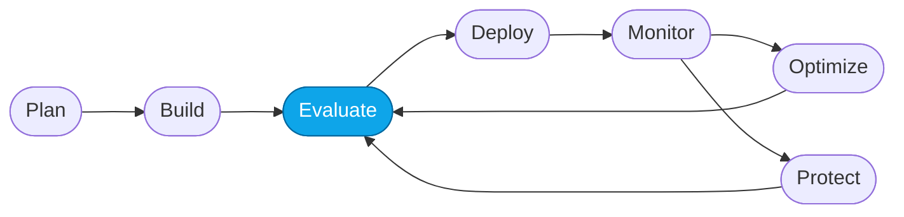

# Lab NN — <Concept or Flow Step>

> **What you'll do:** _one-sentence problem or task._
> **Time:** ~X min · **Prerequisites:** [Lab NN-1](../<phase>/NN-1-...md)

## 🎯 Goal

State the **single concept** taught or the **single step** of the Agent DevOps
loop completed in this lab. Keep it to 1–2 sentences.

## 🧭 Where this fits



> 🧭 **This lab covers:** _<node name>_ — <one line on why now>.

## 📋 Steps

1. **<Atomic action>.**
   Do X. You should now see Y.
2. **<Atomic action>.**
   Do X.
   ```bash
   # commands, if any
   ```
   You should now see Y.
3. **<Atomic action>.**
   ...

> 💡 **Tip:** short, high-value hints go here.
>
> ⚠️ **Gotcha:** _small, lab-specific_ mistakes go inline (≤ 4 lines).
>
> ⚠️ **Gotcha — <error phrase>.** For _cross-cutting_ infra/tool errors
> (anything that recurs across labs or needs multi-step recovery), keep the
> callout to one line and link to the canonical entry in
> [`labs/TROUBLESHOOTING.md`](../TROUBLESHOOTING.md).

## ✅ Verify

An **explicit, testable** check. Examples:

- Open `<portal URL>` and confirm the agent appears with status *Ready*.
- Run:

  ```bash
  ./scripts/smoke-test.sh
  ```

  Expected output includes `Contoso Travel Concierge · ok`.

If this passes, the lab is done.

## 🧠 Recap

- What you learned (1 bullet)
- What changed in the system (1 bullet)
- Why this step matters in the DevOps loop (1 bullet)

## ➡️ Next

Continue with **[Lab NN+1 — <title>](./NN+1-...md)** or take a detour into
[More Labs](../more/README.md) — the workshop-coach will bookmark your place.
