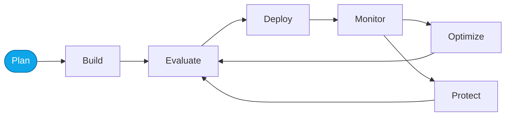

# Lab 00 — Core Labs overview

> **What you'll do:** Preview the Core Labs journey and confirm your prerequisites.
> **Time:** ~5 min · **Prerequisites:** [Fundamentals Lab 06](../fundamentals/06-verify.md)

## 🎯 Goal

Know the order of the four Core Labs (plus the capstone) and what each one adds
to the Agent DevOps loop.

## 🧭 Where this fits

## 📋 Steps

Read the map:

| Lab | Loop node | Tool | You'll produce |
|-----|-----------|------|----------------|
| [01 — Observe portal](./01-observe-portal.md) | Monitor | Foundry portal | first traces |
| [02 — Evaluate portal](./02-evaluate-portal.md) | Evaluate | Foundry portal | a sample dataset + a quality evaluator |
| [03 — Optimize with skills](./03-optimize-skills.md) | Optimize | Copilot + Foundry skills | an optimized prompt |
| [04 — Monitor portal](./04-monitor-portal.md) | Monitor | Foundry portal | evidence the change helped |
| [05 — Capstone (Hosted)](./05-capstone-hosted.md) | Optimize | your own code | same loop applied to `src/` |

## ✅ Verify

Confirm you have both agents responding (from Fundamentals Lab 06). If not,
loop back before starting Lab 01.

## 🧠 Recap

- Core Labs teach the loop; the capstone is where you apply it yourself.
- Every lab targets **one node** of the loop.

## ➡️ Next

**[Lab 01 — Observe traces in the portal](./01-observe-portal.md)**
