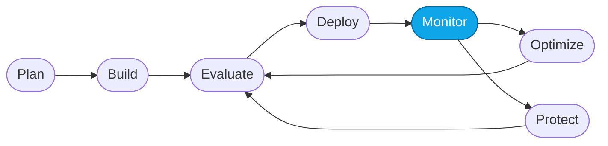

# Core Lab 01 — Observe traces in the portal

> **What you'll do:** Send prompts to the Prompt Agent in the Foundry playground, turn on live evaluators, and inspect the trace + trajectory views.
> **Time:** ~20 min · **Prerequisites:** [Fundamentals Lab 06](../fundamentals/06-verify.md)

## 🎯 Goal

Learn Foundry's built-in observability surface — **live evaluators**,
**traces**, and **replays** — using the Prompt Agent as your subject.

## 🧭 Where this fits



> 🧭 **This lab covers:** _Monitor_ — reading what the agent actually did.

## 📋 Steps

1. **Open the Prompt Agent playground.**
   Foundry portal → **My assets → Agents → `contoso-travel-concierge-prompt` →
   Try in playground**. Close the left details panel; keep the right logs panel
   open.

   <!-- TODO(nitya): screenshot of the playground with logs panel visible -->

2. **Turn on live evaluators.**
   Click the **metrics** button in the playground and enable all built-in
   evaluators (task completion, coherence, groundedness, indirect-attack, …).
   Close the metrics panel.

   > 💡 **Evaluators** are automatic graders. Foundry scores each response as it
   > comes back — no test code needed.

   <!-- TODO(nitya): screenshot of the metrics selection dialog -->

3. **Prompt 1 — single specialist.**
   Send:
   ```text
   What flights are available from Chicago to Rome?
   ```
   You should see:
   - a grounded response citing `CT-FL-...` IDs from `flights.csv`
   - a stream of agent actions in the log panel
   - **AI Quality** scores appearing next to the response

   Click the **AI Quality** badge to open the trace + evaluator detail view.

   <!-- TODO(nitya): screenshot of the response with AI Quality scores -->

4. **Prompt 2 — multi-part request.**
   Send:
   ```text
   Plan a trip from Chicago to Rome for the first two weeks of November.
   I need flights, a hotel, and a car rental.
   ```
   The Prompt Agent will attempt to draw from all three CSVs. Note how the
   trace differs from Prompt 1 — more retrievals, longer turn.

   > 💡 In Core Lab 05 (capstone) you'll ask the **Hosted Agent** the same
   > question and see three specialist sub-agents get delegated to instead.

5. **Prompt 3 — out of scope.**
   Send:
   ```text
   Can you help me write a Python script?
   ```
   Expected: a polite decline that redirects to travel topics.
   If the agent tries to help with Python instead, that's a **groundedness /
   scope failure** — Core Lab 03 will catch it.

   <!-- TODO(nitya): screenshot of the polite refusal + scope evaluator score -->

6. **Open the trace view.**
   For any turn, click the trace link. You'll see spans for each model call,
   tool call, and evaluator run. Note the latency and token counts per span.

## 💭 What you're looking at

| Concept | Meaning |
|---|---|
| **Evaluator** | Automatic grader that scores each response (quality or safety) |
| **Trace** | Step-by-step record of how a turn was produced (model + tool spans + evaluator scores) |
| **Trajectory** | Trace visualized as an agent-to-agent conversation (more useful for the Hosted Agent in Core 05) |
| **Live evaluators** | Evaluators that run during playground turns; contrast with *batch* evaluations in Core 02 |

## ✅ Verify

- All three prompts produced responses with **evaluator scores** attached.
- You opened at least one **trace** and identified at least one span.
- You saved a note about **which evaluator scored lowest** across the three
  prompts — you'll use that in Core Lab 02.

## 🧠 Recap

- Foundry evaluates every playground turn live and captures a trace per turn.
- Traces are the single source of truth for debugging correctness *and*
  latency.
- One weak dimension across three prompts is the *thread* Core Lab 02 pulls on.

## ➡️ Next

**[Core Lab 02 — Evaluate the Prompt Agent with built-in evaluators](./02-evaluate-portal.md)**
