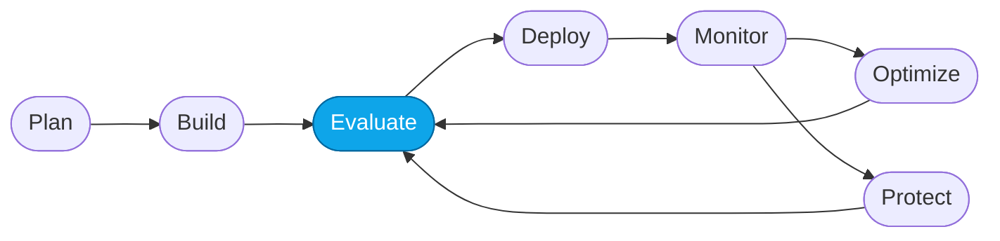

# Core Lab 02 — Evaluate the Prompt Agent with built-in evaluators

> **What you'll do:** Run a **batch evaluation** of the Prompt Agent against a curated dataset in the Foundry portal, and read the results.
> **Time:** ~20 min · **Prerequisites:** [Core Lab 01](./01-observe-portal.md)

## 🎯 Goal

Move from per-turn *live* evaluation to a **batch** evaluation over a whole
dataset. You'll create an evaluation run, wait for results, and identify
concrete failure patterns to fix in Core Lab 03.

## 🧭 Where this fits

> 🧭 **This lab covers:** _Evaluate_ — quantifying how the agent does on a
> known dataset.

## The reference dataset

The workshop ships a curated evaluation dataset at
[`../../artifacts/datasets/reference/evaluation-data-v2.jsonl`](../../artifacts/datasets/reference/evaluation-data-v2.jsonl).
It contains ~15 queries across three difficulty tiers (single-specialist,
multi-part itinerary, and out-of-scope refusal) that together stress-test the
Prompt Agent baseline.

> 💡 **Reproducibility.** You *could* have Foundry generate a dataset for you
> (and Core Lab 03 will), but starting from the shipped reference guarantees
> everyone sees the same failures.

## 📋 Steps

1. **Open Evaluations.**
   Foundry portal → **Build → Evaluations** → **Create** new evaluation.

   <!-- TODO(nitya): screenshot of the "New evaluation" flow -->

1. **Choose the target.**
   Under **Target**, pick the **`contoso-travel-concierge-prompt`** agent.

1. Choose **Single-turn conversations** by default.
1. Choose **One-time** as frequency.
1. Choose **Existing dataset** as data source
   1. **Upload the dataset.**
      Under **Data**, upload
      `artifacts/datasets/reference/evaluation-data-v2.jsonl` (or use
      `./scripts/use-reference.sh datasets evaluation-data-v2` first to stage it).
   1. Wait for upload to complete
   1. Review the data records right in portal.
   1. Switch to the judge model
   1. No need to add anything for custom prompts

1. **Select evaluators.**
   Enable at least:
   - **Task completion**
   - **Groundedness**
   - **Coherence**
   - **Relevance**
   - **Indirect attack** (safety)

   If you deployed a **judge model** in Fundamentals Lab 03, pick it under
   **Evaluator model**.

   <!-- TODO(nitya): screenshot of the evaluator selection panel -->

5. **Run the evaluation.**
   1. Create a custom name e.g., `prompt-agent-eval-run` - optional
   1. Click **Create**. The run takes 2–5 minutes depending on dataset size.

6. **Read the results.**
   When the run finishes, open it. You'll see:
   - **Per-metric aggregate scores** across the whole dataset
   - **Per-row detail** — for each query, the agent's answer, the ground
     truth (if provided), and each evaluator's score + rationale

7. **Identify the top failure pattern.**
   Sort by lowest score. Read three or four low-scoring rows. Look for a
   *common* failure mode — asking-instead-of-answering, missing IDs, no price
   citation, ungrounded superlatives, etc. Write it down; Core Lab 03 will
   target it.

   (Optional) You can choose the evaluations row and click *Analyze results* to have a cluster analysis run for you. This gives you more insights into possible areas for optimization.

   <!-- TODO(nitya): screenshot of a low-scoring row with the evaluator rationale expanded -->

> ⚠️ **Gotcha:** if every score is unusually low, your dataset may not have
> reached the agent. Confirm the target agent name and rerun.

## ✅ Verify

- The evaluation run's status is **Succeeded**.
- You noted the **lowest-scoring evaluator** *and* the **top failure pattern**
  in plain English — e.g. *"agent asks for cabin class instead of answering
  when it isn't supplied"*.

## 🧠 Recap

- Batch evaluation puts a **number** next to a hypothesis about weakness.
- Groundedness + relevance failures usually point at the **prompt**, not the
  model. That's exactly what Core Lab 03 optimizes.
- Reference datasets exist so learners hit the same failures — reproducibility
  by design.

## ➡️ Next

**[Core Lab 03 — Optimize with Foundry Skills + Copilot](./03-optimize-skills.md)**
