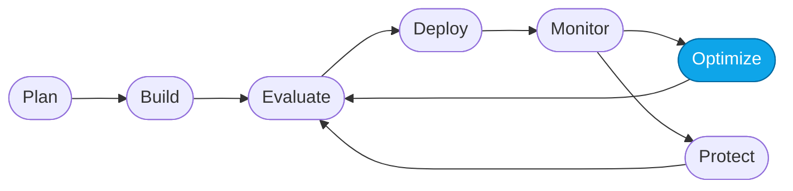

# Core Lab 03 — Optimize with Foundry Skills + GitHub Copilot

> **What you'll do:** Run one full **eval → fix → redeploy** loop from your editor by driving the `microsoft-foundry` **Observe** skill from GitHub Copilot.
> **Time:** ~30 min · **Prerequisites:** [Core Lab 02](./02-evaluate-portal.md)

## 🎯 Goal

Close the loop from **code**. In Core Lab 02 you found a failure pattern in the
portal. Here you fix it by having Copilot + the Foundry Observe skill generate
a targeted dataset, evaluate, recommend, apply, and redeploy.

## 🧭 Where this fits



> 🧭 **This lab covers:** _Optimize_ — the loop that turns "we know it's weak"
> into "we shipped a fix".

## What is the Observe skill?

The **`microsoft-foundry` Observe skill** is a Foundry-authored skill for
GitHub Copilot. In one workflow it:

1. **Generates** a test dataset tailored to your agent's capabilities.
2. **Evaluates** the deployed agent against that dataset with built-in
   evaluators.
3. **Analyzes** the failures and patterns in the results.
4. **Recommends** specific optimizations (usually instruction changes).

You then tell Copilot to **apply** the top recommendation and **redeploy**.

## 📋 Steps

1. **Open your editor.**
   Devcontainer or local checkout of this repo. Make sure `az` and `azd` are
   still signed in (`az account show`, `azd auth login --check-status`).

2. **Reset to a clean baseline.**
   The prompt this lab starts from must be the same for everyone.

   ```bash
   ./scripts/reset.sh
   ```

   > 💡 The **Prompt Agent** starts from
   > `artifacts/prompts/reference/prompt-agent-baseline-v1.md`, which you used
   > when creating it in Fundamentals Lab 04. If you edited it since, re-paste
   > that file into the portal Instructions field before continuing.

3. **Activate Copilot Chat.**
   Open Copilot Chat. Make sure:
   - **Agent mode** is enabled.
   - The **Microsoft Foundry MCP server** is connected (say hello; accept the
     activation prompt if it appears).
   - The model is set to a strong one — **Claude Sonnet 4.6** or **GPT-5.5+**
     are known to give good recommendations.
   - **Bypass Approvals** is on (below the input) so the skill's many small
     tool calls don't stop for confirmation.

   <!-- TODO(nitya): screenshot of Copilot Chat with Foundry MCP + Claude Sonnet + Bypass Approvals -->

4. **List the skills to confirm setup.**
   ```text
   What `microsoft-foundry` skills do you have?
   ```
   You should see `observe`, `deploy`, `evaluate`, and others listed.

5. **Kick off the Observe skill.**
   ```text
   Use the observe subskill of the `microsoft-foundry` skill to evaluate my
   deployed contoso-travel-concierge-prompt agent
   ```

   Copilot will:
   - create a **`.foundry/`** folder with generated evaluators and a test
     dataset,
   - run a **baseline evaluation** against your deployed agent,
   - print a ranked list of **recommendations**.

   Let it run — 3–5 minutes. Do not interrupt.

   <!-- TODO(nitya): screenshot of Copilot streaming the observe workflow tool calls -->

6. **Pick the top recommendation.**
   ```text
   What's the top recommendation, and what change does it propose?
   ```

7. **Apply it.**
   ```text
   Apply the top recommendation and optimize the agent's instructions.
   ```
   Copilot will:
   - edit the Prompt Agent's **Instructions** (through the Foundry MCP),
   - **redeploy** the change,
   - optionally re-evaluate to compare before / after.

   <!-- TODO(nitya): screenshot of the redeploy step and the before/after comparison -->

8. **Snapshot the new prompt for traceability.**
   Copy the optimized instructions out of the Foundry portal and save them as
   `artifacts/prompts/generated/prompt-agent-optimized-v2.md`.
   (The `generated/` subfolder is gitignored — that's on purpose; only
   maintainers promote things to `reference/`.)

> ⚠️ **Gotcha:** if Copilot picks a different agent, be explicit —
> `evaluate my contoso-travel-concierge-prompt (prompt agent)`. If it forgets
> the agent between turns, remind it.

## ✅ Verify

- The Prompt Agent's **Instructions** in the portal are different from what
  you pasted in Fundamentals Lab 04.
- A re-run of the Core Lab 02 evaluation (or Copilot's re-eval) shows the
  target metric **higher** than the baseline.
- `artifacts/prompts/generated/prompt-agent-optimized-v2.md` exists.

## 🧠 Recap

- The Observe skill turns "vibes" about a weak agent into a measured,
  auditable fix.
- **Recommendations are hypotheses, not oracles.** A regression is data.
- You now have two prompt versions to compare (baseline v1 and optimized v2)
  — treat these like versioned code.

## ➡️ Next

**[Core Lab 04 — Monitor & trace outcomes](./04-monitor-portal.md)**
