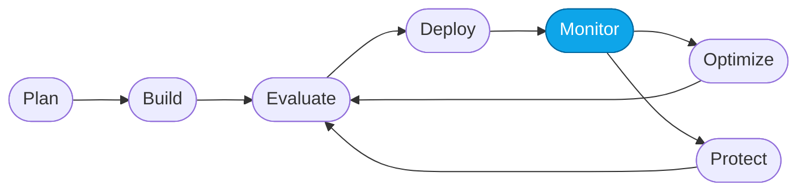

# Core Lab 04 — Monitor & trace outcomes in the portal

> **What you'll do:** Return to the Foundry portal, open the Monitor tab for the Prompt Agent, and read the aggregated view of the changes you just made.
> **Time:** ~15 min · **Prerequisites:** [Core Lab 03](./03-optimize-skills.md)

## 🎯 Goal

Understand how post-deploy behavior is aggregated in Foundry's **Monitor** tab,
and use it to confirm the optimization in Core Lab 03 actually landed in
production.

## 🧭 Where this fits

> 🧭 **This lab covers:** _Monitor_ — post-deploy, aggregate view.

## 📋 Steps

1. **Open the agent's Monitor tab.**
   Foundry portal → **My assets → Agents → `contoso-travel-concierge-prompt`
   → Monitor** (top navigation inside the agent view).

   <!-- TODO(nitya): screenshot of the Monitor tab with all charts visible -->

2. **Read the charts.**
   You should see, at minimum:
   - **Runs** — how many turns the agent has served
   - **Tokens** — total in / out over time
   - **Tool calls** — invocations broken down by tool
   - **Failures** — errored turns
   - **Latency percentiles** — p50 / p95 / p99

3. **Ask the agent helper.**
   Each chart has an **agent helper** icon (a small sparkle in the corner).
   Click it on the **Tokens** chart and ask for an analysis. You'll get an
   AI-generated summary of trends and outliers.

   <!-- TODO(nitya): screenshot of the Tokens chart with the AI-generated analysis panel open -->

4. **Confirm the optimization.**
   Filter the time range to include **before and after** your Core Lab 03
   redeploy. Look for a shift in the failure rate or evaluator scores at that
   moment. If you don't have enough traffic to see it, generate some by
   re-running the three prompts from Core Lab 01 against the optimized agent.

5. **Drill from Monitor into a trace.**
   Click any point on a chart or any row in the runs table. Foundry links you
   straight to the underlying **trace** for that turn — same view as Core Lab
   01. This is the round-trip: aggregate → single request → root cause.

## 💭 Monitor vs. Evaluate vs. Observe

| Surface | Scope | When you use it |
|---|---|---|
| **Live evaluators** (Core 01) | one turn | quick check during playground |
| **Batch Evaluation** (Core 02) | a dataset | quantifying baseline / regression |
| **Monitor** (this lab) | all traffic over time | production health + drift detection |

All three drop you into the same **trace** view when you need root cause.

## ✅ Verify

- You can name the Monitor charts and what each measures.
- You clicked at least one AI-generated analysis and read its summary.
- You navigated from a Monitor chart into a specific trace and back.
- You identified **at least one** aggregate signal (failure rate, evaluator
  score, latency) that changed after Core Lab 03's redeploy.

## 🧠 Recap

- Monitor is your production dashboard for a deployed agent.
- The **agent helper** turns raw metrics into narrative signals — treat it
  like a first-draft analyst.
- Traces are still the ground truth; Monitor is just an aggregator over them.

## ➡️ Next

You've done the loop on the **Prompt Agent**. Apply the same loop to the
**Hosted Agent** in the capstone:
**[Core Lab 05 — Capstone: apply the loop to the Hosted Agent](./05-capstone-hosted.md)**
