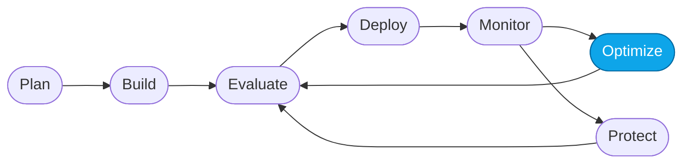

# Core Lab 05 — Capstone: apply the loop to the Hosted Agent

> **What you'll do:** Repeat Core Labs 01–04, but this time against the containerized **`contoso-travel-concierge`** hosted agent. You drive it end-to-end.
> **Time:** ~45 min · **Prerequisites:** [Core Lab 04](./04-monitor-portal.md)

## 🎯 Goal

Prove you can run the full Agent DevOps loop unaided — this time on the more
complex **multi-agent Hosted Agent**. You get lighter guidance here; the labs
above show you the moves.

## 🧭 Where this fits



> 🧭 **This lab covers:** _All nodes_ — one loop end-to-end.

## Why the Hosted Agent is a harder target

| Aspect | Prompt Agent | Hosted Agent |
|---|---|---|
| Structure | Single agent + attached knowledge | Concierge + 3 specialist sub-agents + tools |
| Prompt lives in | Portal Instructions field | `src/instructions/concierge.md` (file, versioned) |
| Redeploy | Save in portal | `azd deploy contoso-travel-concierge` |
| Trace | One agent turn | Concierge → specialist → tool, per sub-agent |
| Reset | Re-paste baseline | `./scripts/reset.sh` |

You'll see richer **trajectories** and need to reason about *which* sub-agent
is the weak link.

## 📋 Steps

Do each step yourself. Refer back to the linked lab if you get stuck.

1. **Reset to the pristine baseline.**
   ```bash
   ./scripts/reset.sh
   azd deploy contoso-travel-concierge --no-prompt
   ```

2. **Observe.**
   Playground the three prompts from
   [Core Lab 01](./01-observe-portal.md) against `contoso-travel-concierge`. Open the
   **Trajectory** view for the multi-part prompt — this is where the Hosted
   Agent shines. Note which sub-agent looks weakest.

3. **Evaluate.**
   Following [Core Lab 02](./02-evaluate-portal.md), run a batch evaluation on
   `contoso-travel-concierge` against
   `artifacts/datasets/reference/evaluation-data-v2.jsonl`. Note the top
   failure pattern.

4. **Optimize.**
   Following [Core Lab 03](./03-optimize-skills.md), drive the
   `microsoft-foundry` Observe skill in Copilot Chat against
   `contoso-travel-concierge`. Let it edit `src/instructions/concierge.md`.

   > 💡 Snapshot the new prompt into the agent's versioned history:
   >
   > ```bash
   > src/scripts/snapshot-instructions.sh "capstone optimization"
   > ```

5. **Redeploy.**
   ```bash
   azd deploy contoso-travel-concierge --no-prompt
   ```

6. **Monitor.**
   Following [Core Lab 04](./04-monitor-portal.md), open the Monitor tab for
   `contoso-travel-concierge`. Confirm the optimization landed and metrics moved.

7. **Clean up (when you're truly done).**
   ```bash
   cd .  # repo root
   azd down --purge --force
   ```
   This tears down everything you provisioned earlier so you stop paying for it.

## ✅ Verify

- `src/instructions/concierge.md` differs from
  `src/instructions/versions/instructions-0.md`.
- `src/instructions/versions/` has at least one new numbered snapshot.
- A batch re-evaluation of `contoso-travel-concierge` shows the target metric
  **higher** than the pre-optimization run.
- You can point at **which sub-agent's behavior changed** (flight, hotel, or
  car rental) based on the trajectory before vs. after.

## 🧠 Recap

- The same DevOps loop applies whether the agent is one prompt or a fleet.
- Multi-agent traces surface *which* sub-agent is the weak link — that
  targeting is the payoff of the hosted architecture.
- Everything you did was reproducible thanks to `reset.sh`, the versioned
  instructions folder, and reference datasets.

## ➡️ Next

You're through the Core Labs 🎉. Take a detour into **[More Labs](../more/README.md)**
for single-question deep dives — troubleshooting, red-teaming, continuous
evaluation, and trace-driven dataset generation.

If you're done for the day, don't forget `azd down` to avoid ongoing cost.
