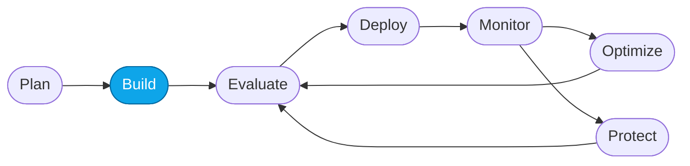
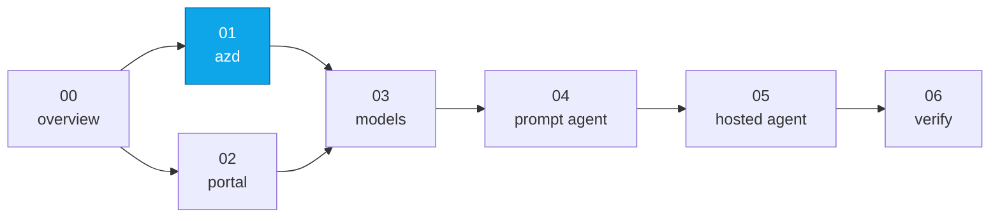
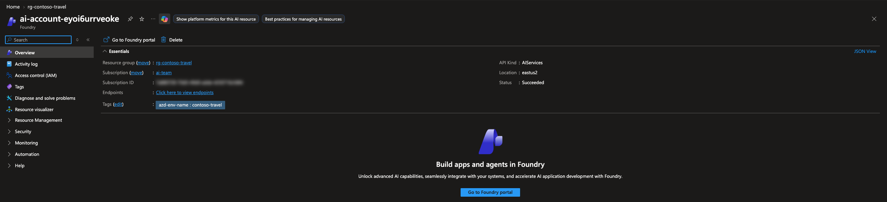
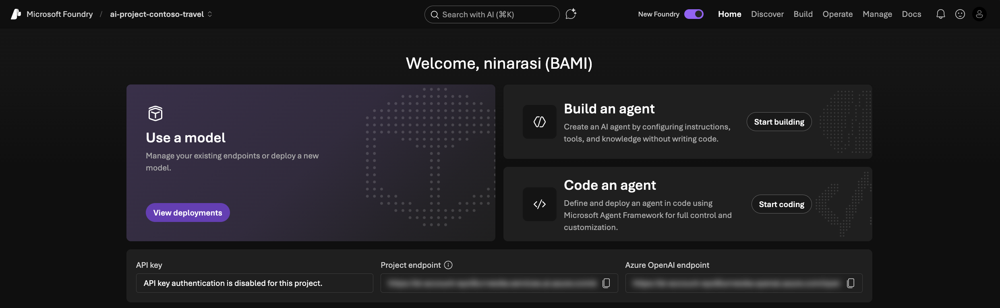

# Lab 01 — Provision Foundry with `azd`

> **What you'll do:** Stand up a Foundry project, deploy the `gpt-5.4-mini` and
> `gpt-5.4-judge` models, and wire up Application Insights and Log Analytics in
> your Azure subscription with a single `azd provision` command. The container
> registry and hosted agent come later in
> [Lab 05](./05-deploy-hosted-agent.md).
> **Time:** ~15 min · **Prerequisites:** [Lab 00](./00-overview.md)
>
> ⏩ **Taking the portal path instead?** Skip to [Lab 02](./02-provision-portal.md).

## 🎯 Goal

Provision the Foundry substrate the rest of the workshop uses — one command,
one resource group, tearable-down in one command at the end.

## 🧭 Where this fits



> 🧭 **This lab covers:** _Build_ — provisioning the substrate you'll deploy the
> Concierge onto.

### 📍 You are here



## Before you start

Confirm you have:

1. An **Azure subscription** where you can create resources.
2. **`gpt-5.4-mini`** and **`gpt-5.4`** Global Standard quota in one of these
   regions:
   - **`eastus2`** ⭐ (default)
   - **`swedencentral`** (EU alternate)
   - **`northcentralus`** (US backup)
3. Either the workshop **devcontainer** open (see `.devcontainer/README.md`)
   or `az`, `azd`, and Python 3.13+ installed locally.

> 💡 **Tip — pre-flight your quota with Copilot.** After `az login` (Step 1
> below), paste this prompt into Copilot Chat to have the
> [`microsoft-foundry`](https://github.com/microsoft/azure-skills/tree/main/skills/microsoft-foundry)
> `quota` sub-skill confirm capacity before you provision:
>
> > Use the microsoft-foundry quota skill to confirm I have GlobalStandard
> > capacity 100 in eastus2 for `gpt-5.4-mini@2026-03-17` and
> > `gpt-5.4@2026-03-05`. If not, recommend the best of `eastus2` /
> > `swedencentral` / `northcentralus`.
>
> If eastus2 comes back short, switch to whichever region the skill
> recommends before running `azd provision`.

> ⚠️ **Cost:** provisioning runs in **your** subscription and incurs cost.
> You'll tear it all down with `azd down` at the end.

## 📋 Steps

1. **Sign in to Azure with `az`.**
   ```bash
   az login --use-device-code
   ```
   Complete the device-code flow in the browser, then pick the subscription
   you want to deploy into. You can verify if you are logged in at any time using:

   ```bash
   az account show
   ```

2. **Sign in with `azd`.**
   ```bash
   azd auth login --use-device-code
   ```
   Complete the same device-code flow. You can verify if you are logged in at any time using:

   ```bash
   azd auth status
   ```

   <!-- TODO(nitya): screenshot of the device-code prompt in the terminal -->

3. **Create an `azd` environment.**

   Run this from the **repo root** (where [`azure.yaml`](../../azure.yaml)
   lives) so `azd` can find the project:

   ```bash
   azd env new contoso-travel
   ```
   This tags all resources under a single prefix so cleanup later is one
   `azd down` away.

   > ✅ **Verify:** the command creates a `.azure/contoso-travel/` folder in the
   > repo root. If you see it (e.g. via `ls -a .azure`), the environment was
   > created successfully.

   > ⚠️ **Gotcha:** if you see `ERROR: no project exists; to create a new
   > project, run 'azd init'`, you're not in the repo root. `cd` to the folder
   > that contains `azure.yaml` and rerun the command.

4. **Provision.**
   ```bash
   azd provision
   ```
   You'll be prompted twice:
   - **Select an Azure Subscription** — pick the subscription to deploy into.
   - **`aiDeploymentsLocation` infrastructure parameter** — choose
     **`(US) East US 2 (eastus2)`** (or one of the alternates above).

   > 💡 **Why `azd provision` and not `azd up`?** `azd up` = `azd provision +
   > azd deploy`. This lab only needs the Foundry substrate — the hosted-agent
   > **deploy** is a deliberate step in [Lab 05](./05-deploy-hosted-agent.md).
   > Splitting them keeps failures easy to diagnose and retries cheap.

   `azd provision` runs the Bicep in [`../../infra/`](../../infra/):
   - resource group (`rg-contoso-travel`)
   - Foundry account + project
   - **`gpt-5.4-mini`** (concierge) + **`gpt-5.4-judge`** model deployments
   - Log Analytics workspace + Application Insights
   - a Foundry project connection to Application Insights

   First run: **~2 minutes**.

   You'll see output similar to:

   ```text
     (✓) Done: Resource group: rg-contoso-travel
     (✓) Done: Foundry: ai-account-xxxxxxxxxxxxx
     (✓) Done: Log Analytics workspace: logs-xxxxxxxxxxxxx
     (✓) Done: Foundry project: ai-account-xxxxxxxxxxxxx/ai-project-contoso-travel
     (✓) Done: Azure AI Services Model Deployment: ai-account-xxxxxxxxxxxxx/gpt-5.4-mini
     (✓) Done: Azure AI Services Model Deployment: ai-account-xxxxxxxxxxxxx/gpt-5.4-judge
     (✓) Done: Application Insights: appi-xxxxxxxxxxxxx
     (✓) Done: Foundry project connection: .../appi-xxxxxxxxxxxxx

   SUCCESS: Your application was provisioned in Azure in 1 minute.
   ```

   > 💡 **Want different models?** The golden path deploys `gpt-5.4-mini` and a
   > `gpt-5.4-judge`. To swap them, set the `AI_PROJECT_DEPLOYMENTS` env var
   > before `azd provision` — see [Lab 03](./03-deploy-models.md).

   > 💡 **What's *not* here yet:** the Container Registry and the hosted agent
   > are **not** provisioned in this lab — you enable and create them when you
   > deploy the hosted agent in [Lab 05](./05-deploy-hosted-agent.md).

   > ⚠️ **Gotcha — soft-deleted resource blocks re-provision.** If you ran
   > `azd provision` in this repo before and see `A soft-deleted resource with
   > this name exists and is blocking deployment`, purge the account (or use a
   > fresh env name). Details in
   > [Troubleshooting · Soft-deleted Cognitive Services account](../TROUBLESHOOTING.md#soft-deleted-cognitive-services-account-blocks-re-provision).

   <!-- DONE: screenshot of a successful `azd provision` output with the project endpoint replaced by code-fenced output above -->

5. **Read the outputs.**
   The tail of `azd provision` prints the link to the deployed resource group in the Azure Portal. Click to visit the portal - you should see a resource group, with provisioned Foundry project and other resources as shown.

   

6. **Visit the Foundry portal.**
   From the resource group, click into the **Foundry** (`ai-account-xxx`) resource — the overview blade has a **Go to Foundry portal** button in the top toolbar that jumps you straight into your project in the Foundry portal, no separate URL required.

   

7. **Explore the Foundry project.**
   You'll land in the **new Microsoft Foundry portal** — confirm the **New Foundry** toggle in the top-right is **on** (the classic view hides most of what we use later). The top nav reflects the developer journey from **Discover** and **Build**, to **Operate** and **Manage**; we'll spend most of the workshop in the **Build** tab (agents, models, prompts). Note that the project Homepage has handy links to the Foundry **endpoint** and **API key** values that you may need later. You can also get these directly using `azd env get-values` - when you provision with azd.  Later labs use this to pick up endpoints automatically.

   

   > ⚠️ **Gotcha — quota / capacity error on `azd provision`.** Details in
   > [Troubleshooting · Quota / capacity errors](../TROUBLESHOOTING.md#quota--capacity-errors-on-azd-provision-or-model-deploy).

## ✅ Verify

Run:

```bash
azd env get-values | grep -E "AZURE_AI_PROJECT_ENDPOINT|AZURE_AI_PROJECT_NAME|AZURE_AI_MODEL_DEPLOYMENT_NAME"
```

Expected: three lines — the project endpoint URL, the project name, and the
model deployment name. If all print, provisioning succeeded. You'll see output
similar to:

```text
AZURE_AI_PROJECT_ENDPOINT="https://ai-account-xxxxxxxxxxxxx.services.ai.azure.com/api/projects/ai-project-contoso-travel"
AZURE_AI_PROJECT_NAME="ai-project-contoso-travel"
AZURE_AI_MODEL_DEPLOYMENT_NAME="gpt-5.4-mini"
```

Then open <https://portal.azure.com>, go to **Resource groups**, and confirm the
`rg-contoso-travel` group contains a Foundry account, a Foundry project,
Application Insights, and a Log Analytics workspace.

> 💡 **Where are the models?** Model deployments (`gpt-5.4-mini`,
> `gpt-5.4-judge`) are sub-resources of the Foundry account, so they don't show
> as separate rows in the Azure Portal resource-group view. To see them, open
> the **Foundry portal**, enable the **new Foundry** toggle (top-right), then
> go to **Build → Models**. Lab 03 walks through this.

> 💡 The Container Registry, AI Search, and Storage show up **after** you enable
> hosted-agent hosting in [Lab 05](./05-deploy-hosted-agent.md) — the
> `azd env set ENABLE_HOSTED_AGENTS true && azd provision` step there adds them
> to this same resource group, before you ever run `azd deploy`.

<!-- TODO(nitya): screenshot of the resource group in the Azure portal -->

## 🧠 Recap

- `azd provision` stood up the Foundry substrate — account, project, the
  `gpt-5.4-mini` and `gpt-5.4-judge` models, and observability (App Insights +
  Log Analytics) — in one shot.
- Splitting **provision** (this lab) from **deploy** ([Lab 05](./05-deploy-hosted-agent.md))
  mirrors the Agent DevOps loop and keeps retries scoped.
- Environment values are stored per-`azd env` and reused by later labs.
- Next you'll **confirm the model deployments** and learn how to change them.

## ➡️ Next

**[Lab 03 — Deploy required models](./03-deploy-models.md)** to verify model deployments succeeded, or jump ahead to
**[Lab 05 — Deploy the hosted agent](./05-deploy-hosted-agent.md)** to ship the
container.

If you're planning to use the **Prompt Agent** (Core Labs 01–04), continue with
**[Lab 04 — Create the Prompt Agent](./04-create-prompt-agent.md)**.
