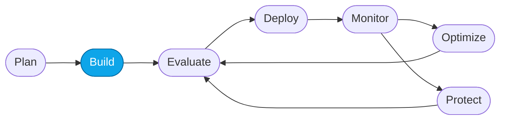
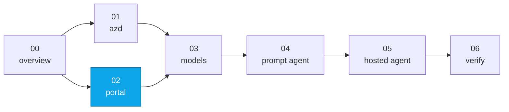

# Lab 02 — Provision Foundry with the Portal

> **What you'll do:** Create a Foundry account + project through the Microsoft Foundry portal, without running any CLI commands.
> **Time:** ~15 min · **Prerequisites:** [Lab 00](./00-overview.md)
>
> ⏩ **Took the `azd` path in Lab 01?** Skip to [Lab 03](./03-deploy-models.md).

## 🎯 Goal

Provision a Foundry **account** and **project** using only the portal, so you
have a UI-first path through the workshop when CLI access isn't practical.

## 🧭 Where this fits

> 🧭 **This lab covers:** _Build_ — provisioning the substrate through the UI.

### 📍 You are here

## Before you start

- An **Azure subscription** with permission to create resources.
- **`gpt-5.4-mini`** Global Standard quota in `eastus2`, `swedencentral`, or
  `northcentralus`.
- A modern browser signed into your Azure account.

## 📋 Steps

1. **Open the Foundry portal.**
   Navigate to <https://ai.azure.com> and sign in with your Azure account.
   If prompted, toggle on **New Foundry**.

   <!-- TODO(nitya): screenshot of the Foundry portal landing page -->

2. **Create a new project.**
   From the portal home, click **+ Create project** (or **Create new** →
   **Foundry project**).

   Provide:
   - **Project name:** `contoso-travel-project` (or your choice)
   - **Foundry resource:** create a **new** resource named `contoso-travel-foundry`
   - **Subscription** + **Resource group** (create `rg-contoso-travel`)
   - **Region:** `eastus2` ⭐

   Click **Create**. Provisioning takes ~2 minutes.

   <!-- TODO(nitya): screenshot of the "Create project" form -->

3. **Wait for the project to open.**
   When the project opens, the sidebar shows **My assets** (Agents, Models &
   endpoints, Playgrounds, Evaluations) and **Build & customize**.

4. **Note the project endpoint.**
   Click the project name in the top-left, open **Overview**, and copy the
   **Project endpoint** URL. Save it — you'll need it whenever the labs
   reference `AZURE_AI_PROJECT_ENDPOINT`.

   <!-- TODO(nitya): screenshot showing where the project endpoint appears in Overview -->

> 💡 **Tip — moving to CLI later?** If you plan to run the CLI-only steps in
> [Lab 05](./05-deploy-hosted-agent.md) to deploy the hosted agent, you'll
> run [`scripts/link-portal-rg.sh`](../../scripts/link-portal-rg.sh) once
> before Lab 05 Step 1. It binds an `azd env` to this portal-created RG so
> `azd provision` reuses it — no second resource group. You don't need to run
> it now.

## ✅ Verify

- The Foundry portal shows your project in the top-left project switcher.
- The Azure portal (<https://portal.azure.com>) shows the
  `rg-contoso-travel` resource group containing your Foundry account.

## 🧠 Recap

- The portal provisions a Foundry **account** (the top-level resource) plus a
  **project** (the workspace).
- The project endpoint is the single URL every SDK and evaluator needs.
- No models yet — you'll deploy those in Lab 03.

## ➡️ Next

**[Lab 03 — Deploy required models](./03-deploy-models.md)**
