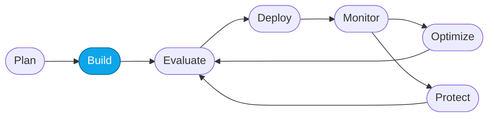
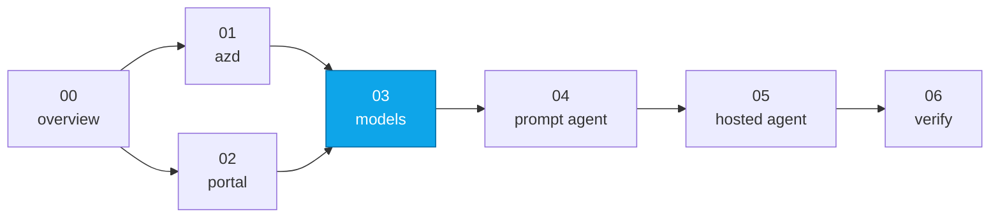

# Lab 03 — Deploy the required models

> **What you'll do:** Deploy `gpt-5.4-mini` and the `gpt-5.4-judge` model into your Foundry project.
> **Time:** ~10 min · **Prerequisites:** [Lab 01](./01-provision-azd.md) **or** [Lab 02](./02-provision-portal.md)

## 🎯 Goal

Deploy the language model(s) your agents and evaluators will call. On the
`azd` path this already happened — `azd provision` deployed `gpt-5.4-mini` and
`gpt-5.4-judge` for you — so this lab is mostly about **confirming** the
deployments and knowing how to add or swap models. On the portal path you
deploy the model by hand here.

## 🧭 Where this fits



> 🧭 **This lab covers:** _Build_ — putting a model behind an endpoint.

### 📍 You are here



## Models this workshop uses

| Deployment name | Purpose | Default region |
|---|---|---|
| `gpt-5.4-mini` | Concierge + specialist reasoning | `eastus2` |
| `gpt-5.4-judge` (`gpt-5.4`) | Judge model for AI-assisted evaluators in Core Lab 02 | `eastus2` |

> 💡 On the `azd` path both `gpt-5.4-mini` and the `gpt-5.4-judge` are deployed
> for you. On the portal path the judge is optional — if your quota is tight,
> reuse `gpt-5.4-mini` as the judge and skip the second deployment.

## 📋 Steps

**If you provisioned with `azd` (Lab 01):**

1. Confirm the deployments already exist:
   ```bash
   azd env get-values | grep -E "AZURE_AI_MODEL_DEPLOYMENT_NAME|AZURE_AI_JUDGE_DEPLOYMENT_NAME"
   ```
   You should see `AZURE_AI_MODEL_DEPLOYMENT_NAME="gpt-5.4-mini"` and
   `AZURE_AI_JUDGE_DEPLOYMENT_NAME="gpt-5.4-judge"`.
1. (Optional) List every deployment in Azure to see both:
   ```bash
   az cognitiveservices account deployment list \
     --resource-group "$(azd env get-value AZURE_RESOURCE_GROUP)" \
     --name "$(azd env get-value AZURE_AI_ACCOUNT_NAME)" -o table
   ```
   You should see both `gpt-5.4-mini` and `gpt-5.4-judge`.
1. ✅ You're done — skip to **Verify**.

> 💡 **Want different models?** The golden path deploys `gpt-5.4-mini` and
> `gpt-5.4-judge`. To change them, set the `AI_PROJECT_DEPLOYMENTS` env var to a
> JSON array **before** `azd provision` (or set it and rerun `azd provision`).
> Setting it replaces the default entirely, so include **every** model you want:
>
> ```bash
> azd env set AI_PROJECT_DEPLOYMENTS '[{"name":"gpt-5.4-mini","model":{"name":"gpt-5.4-mini","format":"OpenAI","version":"2026-03-17"},"sku":{"name":"GlobalStandard","capacity":100}},{"name":"gpt-5.4-judge","model":{"name":"gpt-5.4","format":"OpenAI","version":"2026-03-05"},"sku":{"name":"GlobalStandard","capacity":100}}]'
> azd provision
> ```
>
> ⚠️ **Known limitation.** Once this override is set, later re-provisions
> (e.g. enabling hosted agents in [Lab 05](./05-deploy-hosted-agent.md)) fail
> with `invalid character 'n' after object key:value pair`. Details in
> [Troubleshooting · `invalid character 'n'`](../TROUBLESHOOTING.md#azd-provision-fails-with-invalid-character-n-after-object-keyvalue-pair).

**If you provisioned with the portal (Lab 02):**

1. Open the Foundry portal and select your project.
1. Ensure that the "New Foundry" toggle is active.
1. Switch to the "Build" section in the nav bar.
1. Click on the "Models" tab in the sidebar (it may show as "Deployments")
1. Click the purple "Deploy" button - select "Deploy a base model"
   <!-- TODO(nitya): screenshot of the "Deploy model" button -->
   1. Search for **`gpt-5.4-mini`** and select it.
   1. Select the "custom settings" from the Deploy drop-down
   1. Set the values:
      - **Deployment name:** `gpt-5.4-mini` (match the value your labs reference)
      - **Deployment type:** **Global Standard**
      - **Tokens per Minute (TPM):** the maximum your quota allows (≥ 100k recommended)
   1. Click **Deploy** and wait ~1 minute for the deployment to reach *Succeeded*.
   <!-- TODO(nitya): screenshot of the deployment reaching Succeeded -->

**Optional — judge model:**

1. Repeat the deploy steps above with **`gpt-5.4`** and deployment name
   `gpt-5.4-judge`.
1. You'll reference this in Core Lab 02.

> ⚠️ **Gotcha — Deploy button greyed out.** You're out of quota. Details in
> [Troubleshooting · Quota / capacity errors](../TROUBLESHOOTING.md#quota--capacity-errors-on-azd-provision-or-model-deploy).

## ✅ Verify

In the Foundry portal, visit the **Build** tab and click **Models**. You should
see:

- `gpt-5.4-mini` — Deployment status: **Succeeded**
- `gpt-5.4-judge` — Deployment status: **Succeeded**
  (auto-deployed on the `azd` path; optional on the portal path)

If you used `azd`, confirm **both** deployments from the CLI:

```bash
az cognitiveservices account deployment list \
  --resource-group "$(azd env get-value AZURE_RESOURCE_GROUP)" \
  --name "$(azd env get-value AZURE_AI_ACCOUNT_NAME)" \
  --query "[].name" -o tsv
```

Expected output:

```text
gpt-5.4-mini
gpt-5.4-judge
```

<!-- TODO(nitya): screenshot of the Models list with both deployments -->

## 🧠 Recap

- Models are **deployments** inside a Foundry project — a name, a base model,
  and a TPM budget.
- Deployment names are the identifiers your agents and evaluators reference.
- The `azd` path deploys `gpt-5.4-mini` and `gpt-5.4-judge` for you via Bicep
  (override with `AI_PROJECT_DEPLOYMENTS`); the portal path is a two-minute UI
  flow.

## ➡️ Next

**[Lab 04 — Create the Prompt Agent](./04-create-prompt-agent.md)**
