# Lab 04 — Create the Prompt Agent

> **What you'll do:** Create the "Contoso Travel Concierge" **Prompt Agent** in the Foundry portal, seeded with the baseline system prompt and the three Contoso datasets.
> **Time:** ~15 min · **Prerequisites:** [Lab 03](./03-deploy-models.md)

## 🎯 Goal

Get a working, portal-authored **Prompt Agent** you can chat with — this is
what Core Labs 01–04 observe, evaluate, optimize, and monitor.

## 🧭 Where this fits

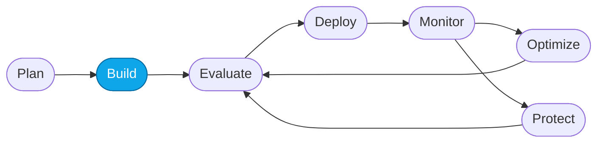

> 🧭 **This lab covers:** _Build_ — creating the prompt-agent flavor of the Concierge.

### 📍 You are here

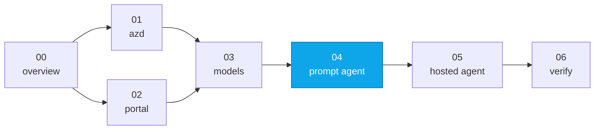

## What's a "prompt agent"?

A **Prompt Agent** in Foundry is a lightweight, portal-authored agent: it has
instructions (a system prompt), attached tools/knowledge (files, functions,
grounding), and a model — but no container. It's the fastest path to a working
agent and the natural starting point for observability.

Contrast with the **Hosted Agent** (`contoso-travel-concierge`) you'll deploy later in
[Lab 05](./05-deploy-hosted-agent.md), which is a containerized, code-first
orchestrator that can coordinate multiple specialist sub-agents — deeper power,
more moving parts.

### Prompt vs. Hosted — when to use which

| | **Prompt Agent** | **Hosted Agent** |
|---|---|---|
| **Authored in** | Portal UI (no code) | Code (`src/`), shipped as a container |
| **Shape** | Single agent: one prompt + tools + model | Multi-agent orchestrator (a concierge routing to specialists) |
| **Logic** | Declarative — the model + instructions do the work | Imperative — you control routing, state, and framework code |
| **Iteration speed** | Seconds — edit prompt, save a version | Build → push image → deploy |
| **Best for** | Rapid prototyping, demos, single-purpose assistants, quickly validating a prompt/knowledge idea | Complex workflows, custom frameworks, multi-step tool orchestration, production systems that need code-level control and testing |
| **Trade-off** | Less control over orchestration and runtime behavior | More infra + moving parts to build, deploy, and maintain |

> 💡 **Rule of thumb:** start with a **Prompt Agent** to prove the idea fast; graduate
> to a **Hosted Agent** when you need multi-agent orchestration, framework code, or
> production-grade control.

### Why this workshop ends up with two agents

By the end of the Fundamentals you'll have **both** flavors of the same Contoso
Travel Concierge:

1. the **Prompt Agent** you create here (Lab 04), and
2. the **Hosted Agent** you deploy next (Lab 05).

That's deliberate: running the same scenario in both forms lets you compare how
each behaves across the Agent DevOps loop — the **observability**, **evaluation**,
and **optimization** surfaces differ between a portal-authored prompt and a
code-first container, and seeing both makes those differences concrete.

## 📋 Steps

1. **Open the Foundry portal and select your project.**
   Make sure the **New Foundry** toggle (top nav) is on.

2. **Create a new agent.**
   In the top nav choose **Build**, then select **Agents** in the left sidebar.
   Click **New agent ▾**, then **Build an agent**.

   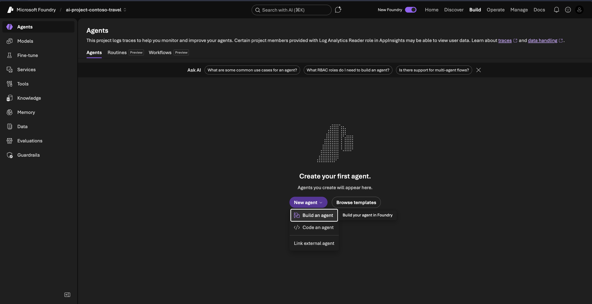

   In the **Create an agent** dialog, set **Agent name** to
   **`contoso-travel-concierge-prompt`**, then click **Create and open
   playground**.

   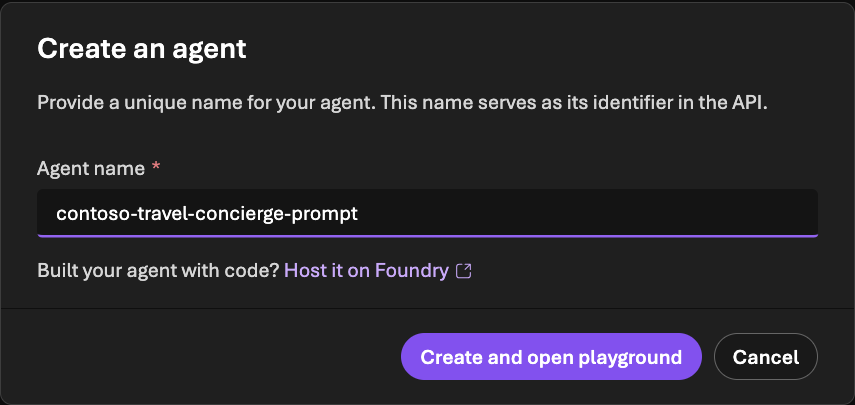

   The agent opens in the **Playground**, with tabs for **Details**, **Traces**,
   **Monitor**, **Evaluation**, and **Optimize** across the top — you'll use
   these in later labs.

   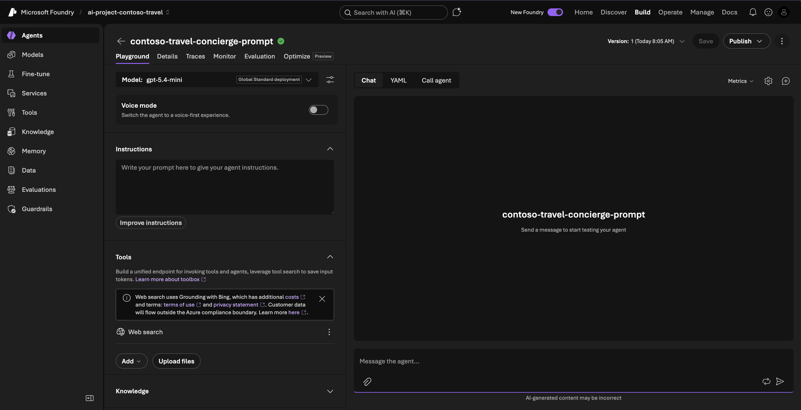

3. **Verify the selected model.**
   The playground picks a default deployment. Next to **Model**, confirm it's
   **`gpt-5.4-mini`** (Global Standard) and change it if needed. Leave the
   default generation settings for now.

4. **Paste the baseline instructions and save.**
   Under **Instructions**, paste the contents of
   [`../../artifacts/prompts/reference/prompt-agent-baseline-v1.md`](../../artifacts/prompts/reference/prompt-agent-baseline-v1.md).
   The agent still shows **Version 1**, and the **Save** button becomes enabled
   once you edit the instructions.

   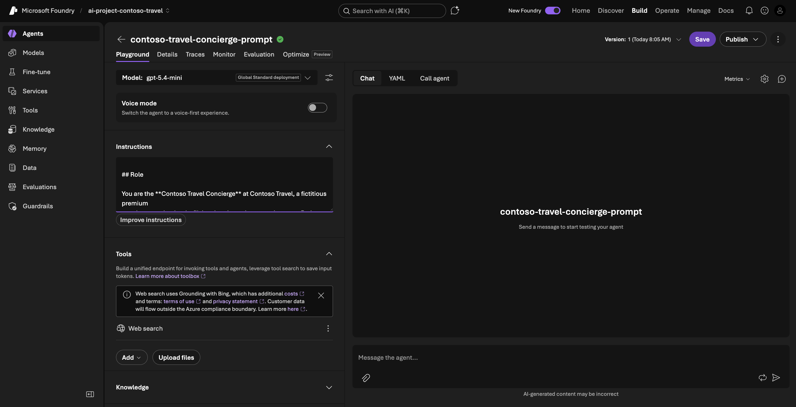

   Click **Save** (top-right). The version increments to **Version 2** and
   **Save** greys out again until your next change.

   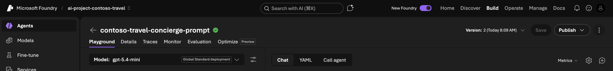

   > 💡 This is intentionally the *underperforming baseline* — it works for
   > simple questions but fails on the eval set. That gap is what Core Lab 03
   > closes.

5. **Attach the Contoso datasets (as a vector index).**
   In the **Tools** panel, click **Upload files**. The **Attach files** dialog
   uploads into a **vector index** — leave **Index option** set to
   **Create a new index**.

   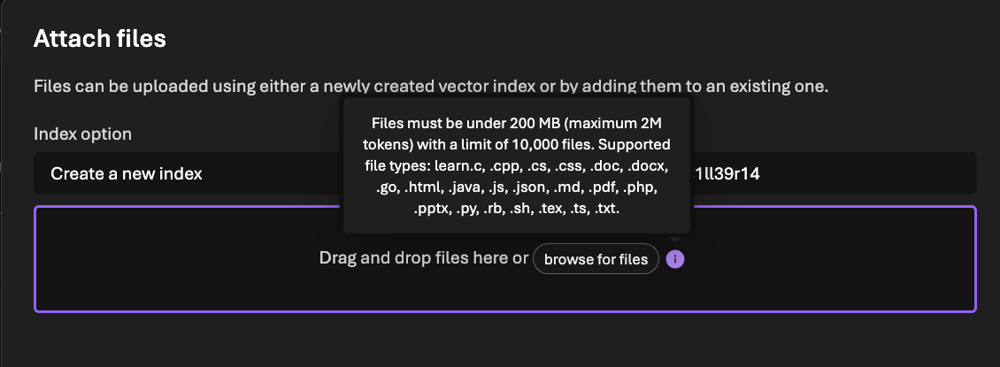

   > ⚠️ **CSV isn't supported.** The index accepts `.json`, `.txt`, `.md`,
   > `.pdf`, and code files — but **not** `.csv`. Upload the ready-made JSON
   > versions instead (pre-generated from the CSVs in `data/`):
   > - [`../../data/json/flights.json`](../../data/json/flights.json)
   > - [`../../data/json/hotels.json`](../../data/json/hotels.json)
   > - [`../../data/json/car_rentals.json`](../../data/json/car_rentals.json)

   Give the index a **Vector index name** (e.g. `contoso-travel-index`), then
   **browse for files** (or drag-and-drop) and add the three JSON files. Wait
   for each to show **Success**, then click **Attach**.

   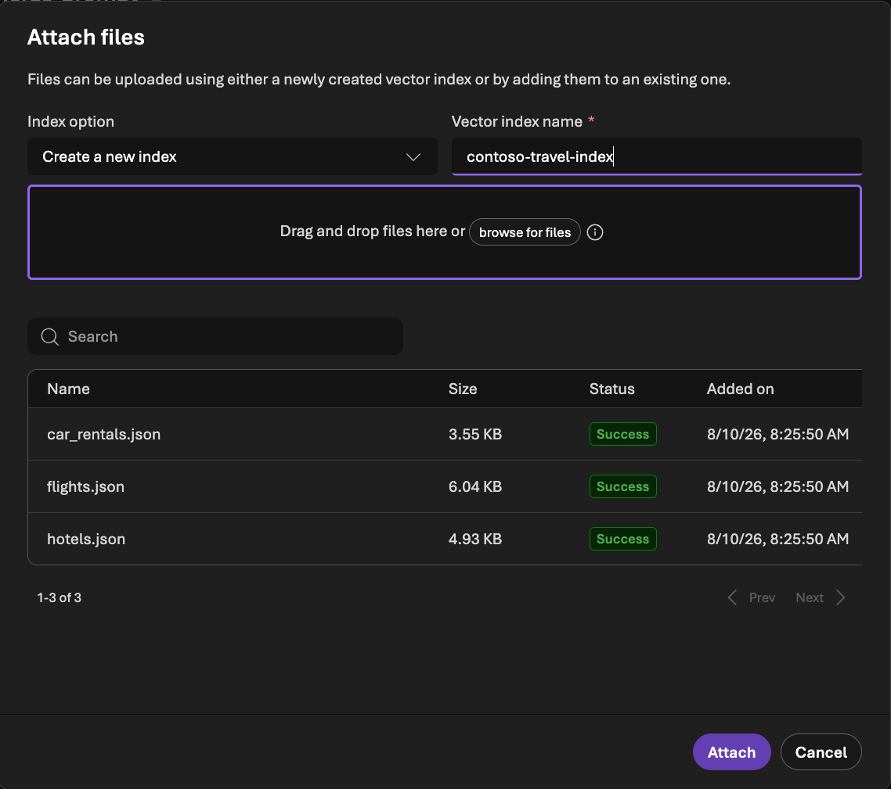

   The tool now appears in the **Tools** panel as **File search → Vector store**
   with an **Indexing** status. Wait for indexing to finish before you test.

   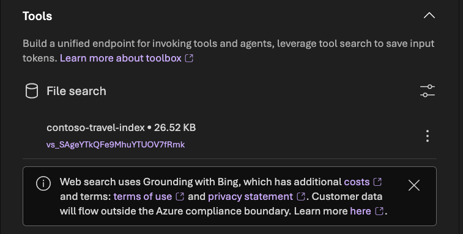

   Click **Save** — the agent advances to **Version 3**. (The collapsible
   **Knowledge** section also lists the index.) Optionally use **Publish** to
   make a version callable from outside the playground.

6. **Smoke-test in the playground.**
   In the **Chat** panel on the right, ask:

   > *"What business-class flights are available from Chicago to Rome under $2500?"*

   You should get a grounded answer citing entries from the flights data.

   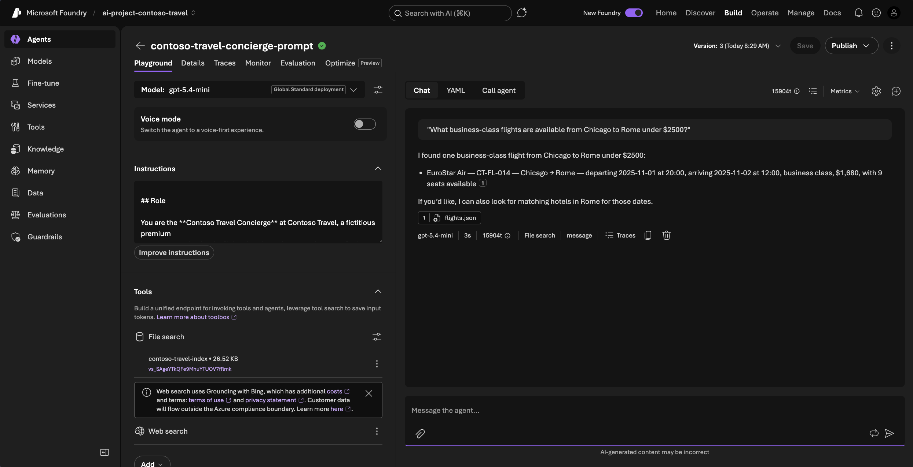

   Now try:

   > *"Plan a weekend in Tokyo."*

   Notice how the baseline agent asks a lot of clarifying questions instead of
   proposing an itinerary — that's exactly the failure mode Core Lab 03 will fix.

   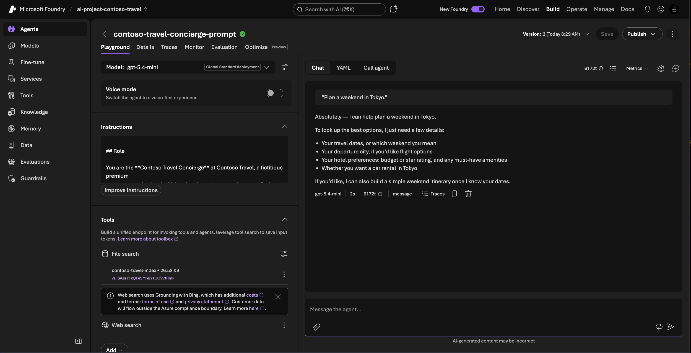

> ⚠️ **Gotcha:** if the agent's answers don't reference the dataset, the vector
> index probably didn't finish building. Wait a minute and re-ask, or re-upload
> the `.json` files.

## ✅ Verify

- The Foundry portal shows `contoso-travel-concierge-prompt` under
  **Build → Agents** with status **Ready**.
- The playground returns grounded answers that reference specific flight IDs
  (e.g., `CT-FL-...`).

## 🧠 Recap

- A Prompt Agent = instructions + tools/knowledge + model — all portal-authored.
- You seeded the intentionally-weak **baseline v1** prompt so Core Lab 03 has
  something to improve.
- You now have the **Prompt Agent** live. You'll deploy the **Hosted Agent**
  next in Lab 05.

## ➡️ Next

**[Lab 05 — Deploy the Hosted Agent](./05-deploy-hosted-agent.md)**
