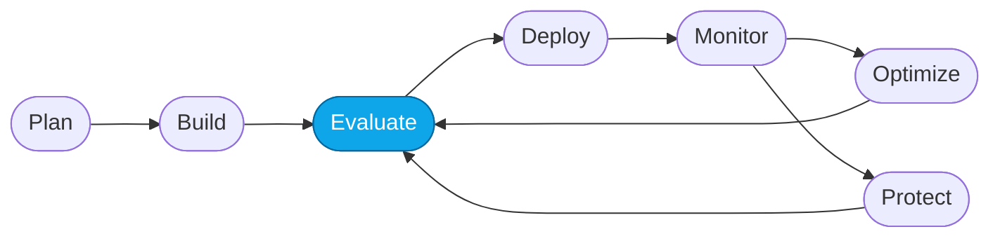
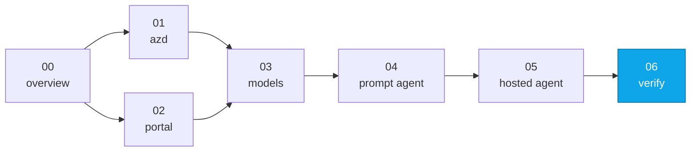

# Lab 06 — End-to-end verification

> **What you'll do:** Confirm both agents answer a canonical question end-to-end before moving into the Core Labs.
> **Time:** ~5 min · **Prerequisites:** [Lab 04](./04-create-prompt-agent.md), [Lab 05](./05-deploy-hosted-agent.md)

## 🎯 Goal

Prove that everything you set up in Fundamentals is wired correctly — both the
Prompt Agent and the Hosted Agent respond to the same question with grounded
answers. This is your **green baseline** for the Core Labs.

## 🧭 Where this fits

> 🧭 **This lab covers:** _Evaluate_ (informally) — a smoke check before the
> real evaluation labs.

### 📍 You are here

## The canonical question

> **"What business-class flights are available from Chicago to Rome under
> $2500?"**

This question:

- exercises the flight tool / dataset,
- has an unambiguous answer grounded in `data/flights.csv`,
- and comes up again in Core Lab 02 as an evaluation input.

## 📋 Steps

1. **Ask the Prompt Agent.**
   Portal → **My assets → Agents → `contoso-travel-concierge-prompt` → Try
   in playground** → paste the canonical question.

   Expected: at least one specific flight ID (like `CT-FL-...`) with airline,
   route, and price. If it *asks a clarifying question instead*, that's the
   baseline weakness — still a pass for this lab.

   <!-- TODO(nitya): screenshot of the Prompt Agent playground response -->

2. **Ask the Hosted Agent.**
   Portal → **My assets → Agents → `contoso-travel-concierge` → Try in playground**
   → paste the same question.

   Expected: a grounded answer plus a **trace** in the right pane showing the
   Concierge delegating to `flight_agent`, which called `search_flights`.

   <!-- TODO(nitya): screenshot of the Hosted Agent playground response with trace panel visible -->

3. **Confirm both traces are visible.**
   In each playground, expand the trace panel. You should see spans for the
   agent turn and (for the hosted agent) sub-spans for the specialist agent
   and its tool call.

4. **Save your notes.**
   Copy the project endpoint and both agent names into your notes. Core Lab 01
   assumes you have them.

## ✅ Verify

- Both agents return a grounded answer with flight IDs.
- Both agents' playground trace panels show at least one span for the turn.
- (Hosted only) The trace shows the sub-agent hand-off (Concierge →
  flight_agent → tool).

If all three check out, **Fundamentals is complete**.

## 🧠 Recap

- The Prompt Agent and the Hosted Agent solve the same problem two ways.
- Traces are captured automatically for both — you'll use them heavily in Core.
- The Prompt Agent's under-answer here is the **motivation** for Core Lab 03
  (optimization).

## ➡️ Next

Enter the Core Labs with **[Core Lab 00 — Overview](../core/00-overview.md)**.
