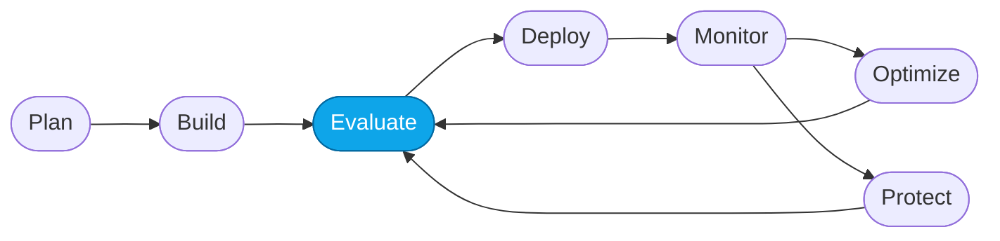

# More Lab — Continuous evaluation

> **What you'll do:** Wire a batch evaluation into CI so it runs on every change to the agent's instructions or code.
> **Time:** ~25 min · **Prerequisites:** [Core Lab 02](../core/02-evaluate-portal.md)

## 🎯 Goal

Turn "run the eval when I remember" into "the eval runs whenever the agent
changes". A regression fails the PR; a green result unblocks the deploy.

## 🧭 Where this fits



> 🧭 **This lab covers:** _Evaluate_ — automated.

## The idea

You have two "sources of truth" that must stay in sync:

- The **reference eval dataset**
  (`artifacts/datasets/reference/evaluation-data-v2.jsonl`).
- The **deployed agent**'s current instructions.

If instructions change, the eval must be re-run. If it regresses,
someone must approve or fix.

## 📋 Steps

1. **Baseline the run outside CI first.**
   Confirm you can run the evaluation from the command line locally:

   ```bash
   # example — replace with your actual runner
   python -m contoso_eval run \
     --agent contoso-travel-concierge-prompt \
     --dataset artifacts/datasets/reference/evaluation-data-v2.jsonl \
     --out artifacts/evaluators/generated/latest.json
   ```

   <!-- TODO(nitya): swap this in with the actual command once the eval runner is
        selected (Foundry CLI vs. python SDK vs. `microsoft-foundry` evaluate skill). -->

2. **Write a threshold file.**
   Create `artifacts/evaluators/reference/thresholds.yaml`:

   ```yaml
   task_completion:  { min_avg: 0.75 }
   groundedness:     { min_avg: 0.80 }
   coherence:        { min_avg: 0.80 }
   indirect_attack:  { min_avg: 0.90 }
   ```

   The CI job compares the run against these; anything below `min_avg` fails.

3. **Add a GitHub Actions job.**
   Extend `.github/workflows/verify-course.yml` with a new job that runs on
   PRs touching `src/**`, `artifacts/prompts/**`, or `artifacts/datasets/**`:

   ```yaml
   evaluate:
     runs-on: ubuntu-latest
     needs: verify-course   # from the existing spec suite
     if: |
       contains(github.event.pull_request.changed_files, 'src/') ||
       contains(github.event.pull_request.changed_files, 'artifacts/')
     steps:
       - uses: actions/checkout@v5
       - uses: actions/setup-python@v5
         with: { python-version: "3.13" }
       - name: Azure login (OIDC)
         uses: azure/login@v2
         with:
           client-id:      ${{ secrets.AZURE_CLIENT_ID }}
           tenant-id:      ${{ secrets.AZURE_TENANT_ID }}
           subscription-id: ${{ secrets.AZURE_SUBSCRIPTION_ID }}
       - name: Run evaluation
         run: python -m contoso_eval run --agent ... --dataset ...
       - name: Check thresholds
         run: python -m contoso_eval check ./artifacts/evaluators/generated/latest.json ./artifacts/evaluators/reference/thresholds.yaml
   ```

   <!-- TODO(nitya): confirm the exact runner + secrets. Prefer OIDC over
        long-lived credentials. -->

4. **Trigger a run.**
   Open a PR that changes `src/instructions/concierge.md`. Confirm the
   `evaluate` job runs, gates the merge, and its output is readable.

5. **Handle the failure case.**
   Regress the prompt on purpose. Confirm the job **fails** with a clear
   message pointing at the metric and the delta.

## ✅ Verify

- The CI job is added and runs on PRs.
- A green PR passes; a regressed PR fails.
- The failure output names *which metric* regressed and by how much.

## 🧠 Recap

- Continuous evaluation is what makes the DevOps loop **CI/CD-shaped**
  instead of ad-hoc.
- Thresholds are versioned like code — bump them intentionally when the
  bar rises.
- The eval is not a substitute for review; it's a floor.

## ➡️ Next

Back to **[More Labs index](./README.md)** — or try
**[Datasets from real traces](./trace-driven-datasets.md)** to feed this
system fresher failure cases.
