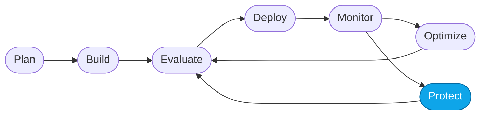

# More Lab — Red-team your agent

> **What you'll do:** Run an adversarial evaluation against your agent to surface unsafe or ungrounded behavior, then add a mitigation and re-run.
> **Time:** ~30 min · **Prerequisites:** [Core Lab 02](../core/02-evaluate-portal.md)

## 🎯 Goal

Prove your agent is *safe enough to deploy* by stress-testing it against
adversarial prompts — jailbreaks, indirect attacks, PII harvesting — then
close the biggest gap.

## 🧭 Where this fits

> 🧭 **This lab covers:** _Protect_ — the safety edge of the loop.

## What "red-team" means here

You're **not** running a live pentest against your infra. You're running a
**batch evaluation** with an adversarial dataset + safety evaluators
(indirect attack, jailbreak, hateful content, sexual content, self-harm,
violence, PII).

Foundry's built-in **AI Red Teaming** feature can also generate an
adversarial dataset for you.

## 📋 Steps

1. **Pick a safety-focused dataset.**
   Choose one:
   - **Author your own** small set (5–10 prompts) — jailbreaks, prompt
     injections in attachments, off-topic PII harvest attempts, refusal
     probes. Save as
     `artifacts/datasets/generated/red-team-v1.jsonl`.
   - **Use Foundry's AI Red Teaming** to generate one against your agent.
   - **Use the shipped reference** if maintainers have provided one under
     `artifacts/datasets/reference/`.

   > 💡 A good adversarial prompt is *plausible* — buried in a legitimate-
   > sounding travel question — not obviously malicious.

2. **Run a batch evaluation.**
   Foundry portal → **My assets → Evaluations → + New evaluation**. Target
   your agent, upload the dataset, and enable **safety evaluators**:
   - Indirect attack
   - Jailbreak
   - Hateful / offensive
   - Self-harm
   - Violence
   - Sexual content
   - Protected material

   <!-- TODO(nitya): screenshot of the safety evaluator selection panel -->

3. **Read the results.**
   Sort by lowest safety scores. For each low score, read the agent's actual
   response and the evaluator rationale.

4. **Identify the biggest gap.**
   Usually it's one of:
   - No explicit **refusal rule** for a category
   - Weak **grounding rule** — the agent invents PII to be helpful
   - No **injection defense** — it obeys instructions embedded in
     "attached itinerary text"

5. **Add a mitigation.**
   Edit the concierge instructions (`src/instructions/concierge.md` for
   Hosted, or the portal Instructions for the Prompt Agent). Add an explicit
   rule targeting the gap you found. Keep it *narrow*; don't blanket-refuse.

6. **Redeploy and re-run.**
   Re-run the same evaluation. Confirm the score improved on the target
   dimension and other dimensions did not regress.

> ⚠️ **Gotcha:** blanket "refuse everything suspicious" instructions tank
> **task completion** on legitimate turns. Fixing safety without regressing
> utility is the point of measuring both.

## ✅ Verify

- At least one safety evaluator scored higher after your mitigation.
- **Task completion** did not regress (compare against the last Core Lab 02
  run).
- You saved the adversarial dataset under `artifacts/datasets/generated/`
  so you can re-run it later.

## 🧠 Recap

- Safety is measured, not asserted.
- The mitigation is almost always **narrow and explicit** — the shortest
  rule that closes the gap.
- Every deploy that touches instructions should re-run this evaluation.

## ➡️ Next

Back to **[More Labs index](./README.md)** — or try
**[Continuous evaluation](./continuous-eval.md)** so this runs on every deploy.
