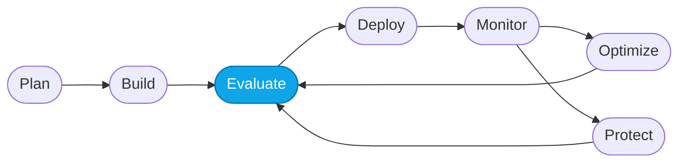

# More Lab — Datasets from real traces

> **What you'll do:** Turn real production traces into a fresh evaluation dataset so the eval catches the failures your users actually hit.
> **Time:** ~30 min · **Prerequisites:** [Core Lab 04](../core/04-monitor-portal.md), [Continuous evaluation](./continuous-eval.md) recommended

## 🎯 Goal

Close the drift gap between what the eval covers and what production actually
sees. You'll mine traces for interesting turns, curate them into a versioned
dataset, and swap it into the eval loop.

## 🧭 Where this fits



> 🧭 **This lab covers:** _Evaluate_ — with dataset freshness.

## The idea

Reference datasets go stale. Users find edge cases you didn't imagine.
The best next test case is the one you just barely got away with in prod.

## 📋 Steps

1. **Decide what "interesting" means for you.**
   Pick a filter — e.g.:
   - low **groundedness** score
   - long **latency** (p95 outliers)
   - specific **tool** call sequence you want to guard
   - **out-of-scope** turns the agent tried to answer anyway

2. **Query traces.**
   Foundry surfaces traces through App Insights (Log Analytics workspace
   the `azd up` template provisioned) and through the portal's Monitor +
   trace views.

   <!-- TODO(nitya): confirm and paste the KQL you standardize on. Suggestion:
        traces
        | where cloud_RoleName == "contoso-travel-concierge"
        | where customDimensions.evaluator_groundedness < 0.5
        | project timestamp, input=customDimensions.user_input, output=customDimensions.assistant_response
        | take 100
   -->

3. **Export and de-identify.**
   Export the query results. Strip any PII **before** you check them into
   the repo. If in doubt, don't check it in — keep it under
   `artifacts/datasets/generated/` (gitignored).

4. **Curate into JSONL.**
   Reduce the export to the schema in
   [`specs/schemas/dataset.schema.json`](../../specs/schemas/dataset.schema.json).
   Each row = one query, optional expected fields, optional metadata.

   ```jsonl
   {"query": "...", "expected": "...", "meta": {"source_trace": "..."}}
   ```

5. **Version and ship.**
   Save as `artifacts/datasets/generated/traces-YYYY-MM-DD.jsonl`.
   If you want it to be the new reference, promote it:

   ```bash
   cp artifacts/datasets/generated/traces-YYYY-MM-DD.jsonl \
      artifacts/datasets/reference/evaluation-data-v2.jsonl
   ```

   Update `specs/course.yaml` to reference `v2` and open a PR. The
   `test_artifacts` test will validate the schema.

6. **Re-run the eval.**
   Point Core Lab 02 (or your CI evaluate job) at the new dataset. Expect
   *lower* baseline scores than v1 — that's the point.

## 💭 Curation etiquette

| Do | Don't |
|---|---|
| Include a mix of pass, near-pass, and fail turns | Ship only failures — you'll over-fit fixes |
| De-identify aggressively | Rely on ad-hoc redaction with `sed` |
| Keep a size budget (e.g., 50 rows) | Ship the whole export |
| Note the source trace in `meta` | Discard the trace ID — you'll want it later |

## ✅ Verify

- A new dataset exists under `artifacts/datasets/` following the schema.
- `pytest -q` still passes (`test_artifacts` validates the shipped rows).
- A batch evaluation ran against the new dataset and its results are
  captured in `artifacts/evaluators/generated/`.

## 🧠 Recap

- Trace-driven datasets keep evals honest as usage evolves.
- Curation matters more than volume — 30 well-chosen rows > 500 raw ones.
- `reference/` is a promotion target, not a dumping ground.

## ➡️ Next

Back to **[More Labs index](./README.md)**.
