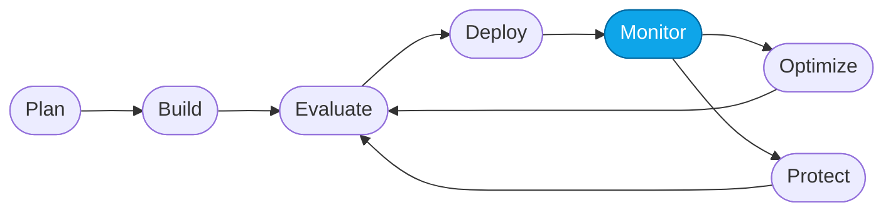

# More Lab — Troubleshoot a failing trace

> **What you'll do:** Take a single failing turn and diagnose the root cause using traces, spans, and evaluator rationales.
> **Time:** ~20 min · **Prerequisites:** [Core Lab 01](../core/01-observe-portal.md)

## 🎯 Goal

Learn a reproducible diagnosis flow for a single bad turn — one that works
whether the failure is a wrong answer, a slow tool, or a bad sub-agent
delegation.

## 🧭 Where this fits



> 🧭 **This lab covers:** _Monitor_ — turning a single failure into a fix.

## The scenario

You have (or will fabricate) a failing turn. Maybe:

- The Concierge answered "I don't have any flights" for a route your data
  covers.
- A sub-agent took 30 s to return.
- An evaluator scored **Groundedness = 1** on an answer that looked fine.

## 📋 Steps

1. **Pick your subject.**
   Either open **Monitor** and click a low-scoring turn, or reproduce a
   failure by pasting a known-bad prompt into the playground. Note the
   **trace ID**.

   Suggested reproducer prompt:

   ```text
   Book me a first-class flight from Sydney to Reykjavík next Tuesday.
   ```

   (Neither city is in the dataset — the agent should refuse gracefully.
   The baseline may hallucinate.)

2. **Read top-down.**
   Open the trace. Start at the top-level agent span. Ask:
   - Did the agent understand the user intent? (top span input vs. user
     message)
   - Did it decide correctly what to do?

3. **Follow the delegation.**
   For the Hosted Agent, expand the concierge span → specialist sub-agent
   span → tool span. Ask at each level:
   - Was the delegation to the right specialist?
   - Did the specialist call the right tool with the right arguments?
   - Did the tool return what the specialist expected?

4. **Read the evaluator rationales.**
   Each evaluator that scored the turn attaches a **rationale** describing
   why. This is often more useful than the score itself.

5. **Form and test a hypothesis.**
   Pick the **smallest** change that could plausibly fix this class of turn
   (usually a prompt line, not code). Apply it. Rerun the same prompt.

6. **Widen your net.**
   Take one other turn from Monitor that failed *differently* and confirm
   your fix didn't regress it.

## 💭 Failure-to-fix cheat sheet

| Symptom | Likely layer | Where to look first |
|---|---|---|
| Agent asks instead of answers | Prompt | Concierge instructions — is a "required field" list too strict? |
| Wrong specialist chosen | Prompt | Concierge routing rules |
| Right specialist, wrong tool args | Sub-agent prompt or tool schema | Sub-agent instructions + `@tool` annotations |
| Tool returns empty | Data / query | Tool span args + underlying CSV |
| Hallucinated ID / price | Prompt (grounding) | Add "cite an ID from the tool result" rule |
| Slow turn | Tool latency or parallelism | Trajectory replay for streaming timing |

## ✅ Verify

- You can name **which span** the failure originated at (concierge, sub-agent,
  or tool).
- You applied **one small change** and reran; the same prompt now passes.
- One other prompt still passes (no regression).

## 🧠 Recap

- Bugs in agents are usually **prompt bugs**, not code bugs — the trace tells
  you which prompt.
- Evaluator rationales are the fastest way to skip past guessing.
- The fix loop is: hypothesis → single small change → re-run → widen.

## ➡️ Next

Back to **[More Labs index](./README.md)** — or try
**[Red-team your agent](./red-teaming.md)**.
